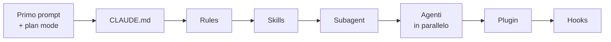

# Claude Code — le fondamenta

CLAUDE.md · rules · skills · agenti · plugin · hooks

---

<!-- disabled -->

<!-- .slide: class="author-slide" -->

<div class="author-photo">
  
  
</div>

<div class="author-bio">
  <h1>Fabio Biondi</h1>
  <ul>
    <li>Cosa fai</li>
    <li>Per cosa sei <strong>conosciuto</strong></li>
    <li>Dove trovarti</li>
  </ul>
  <p class="author-meta">❤️ <strong>fabiobiondi.dev</strong></p>
</div>

Note: slide disattivata finché non metti le foto vere in assets/author/ e la bio. Togli la riga "disabled" per riattivarla.

---

## Il problema

Claude Code **sa scrivere codice**.

Quello che non sa è **come si lavora nel tuo progetto**:

- quali file si toccano
- cosa non si fa mai
- cosa si ripete uguale ogni volta

<div class="box">

Oggi impariamo a spiegarglielo **una volta sola**, invece di ripeterlo in ogni prompt.

</div>

Note: il modello non cambia durante il corso. Cambia il progetto: alla fine lavora con Claude meglio di adesso perché gli abbiamo spiegato come funziona, nel formato che Claude legge.

---

## Quattro modi di dire a Claude come lavorare

| | Quando agisce | Chi decide |
|---|---|---|
| **Regola** | sempre, sta nel contesto | Claude, che la legge e la applica |
| **Skill** | quando serve, per un lavoro che si ripete | Claude dalla `description`, o tu con `/` |
| **Subagent** | per un lavoro isolato, con un contesto suo | Claude, o tu che glielo chiedi |
| **Hook** | a un evento preciso, prima o dopo un'azione | nessuno: succede e basta |

Il **plugin** non è un quinto modo: è la **scatola** in cui porti skill e agenti in ogni repo, e li dai agli altri.

Note: è la mappa di tutta la giornata. Torniamo a questa tabella alla fine, e a quel punto ogni riga avrà un esempio che avete visto funzionare.

---

## Il percorso



Ogni passo **dà per scontato quello prima**. Alla fine è tutto dentro lo stesso progetto.

Note: il filo conduttore è un progetto React vuoto (Vite) che diventa una piccola libreria di componenti con una vetrina. Nessun codice scaricato: tutto quello che c'è dentro l'ha fatto chi segue il percorso.

---

## Cosa serve

```bash
node -v            # 20 o superiore
claude --version   # npm install -g @anthropic-ai/claude-code
```

- un editor con **terminale integrato**
- **due terminali** sempre aperti: `npm run dev` e `claude`
- (in team) **un terzo**, per `git` e `npm run check` a mano
- **git** dal primo minuto: ogni passo si chiude con un commit

Note: consiglio di restare su Sonnet per gli esercizi: sono tarati per finire in fretta, e se si bruciano i limiti d'uso a casa si arriva in aula senza.
