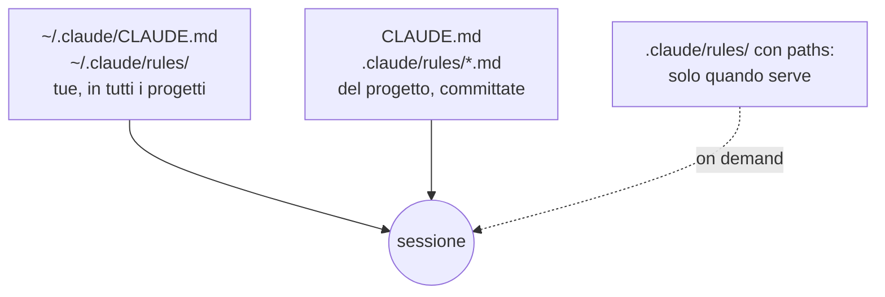

# Rules

Le regole che crescono, senza gonfiare il CLAUDE.md

---

## Una regola o un auspicio?

<div class="cols">
<div class="col">

**Non servono a niente**

- Scrivi codice pulito
- Tipizza bene
- Segui le best practice

</div>
<div class="col">

**Funzionano**

- Export nominali, mai `default`
- Le props stanno in una `interface <Nome>Props` esportata
- Lo stile sta in `<Nome>.css`, niente `style` inline

</div>
</div>

<div class="box">

Il test: **guardando il codice, questa regola mi fa rispondere sì oppure no?**
Se no, non è una regola. È un auspicio.

</div>

Note: i due elenchi vogliono dire più o meno la stessa cosa. Ma «pulito» secondo chi? Claude farà quello che a lui sembra pulito, non quello che intendevi tu.

---

## `.claude/rules/`: un file per argomento

```text
.claude/
└── rules/
    ├── api.md       ← come si usano i componenti da fuori
    ├── ui.md        ← regole dentro i componenti
    └── testing.md   ← …e così via, man mano che crescono
```

- Claude carica **tutti** i `.md` della cartella, all'avvio
- stessa priorità del `CLAUDE.md`, **nessuna configurazione**
- aggiungi un file e vale

Il `CLAUDE.md` resta **corto**: la mappa. I dettagli crescono qui.

---

## La forma di una regola

```markdown
# API dei componenti

- **Il testo visibile di un componente arriva da `children`.**
  Niente prop `text`, `label` o `content`: si scrive `<Badge>Nuovo</Badge>`,
  non `<Badge text="Nuovo" />`. Così ogni componente si usa allo stesso modo.
```

- **la regola in grassetto**: verificabile con un sì o un no
- **il perché in coda**: mezza frase, aiuta Claude nei casi limite
- scritta **a mano**: la forma la decidi tu

Note: da dove nasce la regola? Dalla decisione che Claude ha preso da solo sullo Spinner e che avresti voluto decidere tu. Le regole migliori nascono da un errore visto, non da un elenco astratto.

---

## Regole che valgono solo in una parte

```markdown [1-4|6-8]
--- 
paths:
  - "src/components/**/*.tsx"
--- 

# Regole dei componenti

- **L'elemento più esterno ha `data-ui="<nome>"`**, in minuscolo.
```

- senza `paths`: caricata **all'avvio**, vale ovunque
- con `paths`: caricata solo quando Claude **apre** un file che corrisponde
- mentre lavori sulla documentazione, **non occupa contesto**

Note: attenzione al caso limite, lo rivediamo con gli agenti in parallelo: chi crea un file da zero può non aprirne nessuno che corrisponde, e la regola con paths non si carica.

---

## Dove vivono le regole



**Personali** in `~/.claude/`, **del team** nel repo. Le preferenze tue non vanno imposte agli altri.

---

## Una regola non riscrive il codice di ieri

I componenti nati **prima** della regola quasi certamente non la rispettano. Succede in ogni progetto vero.

La risposta è un giro di allineamento, **una volta sola**:

```text
Allinea Badge, Button e Stack alle regole in .claude/rules/. Non cambiare altro.
```

```bash
git diff --stat   # tre file, poche righe. Di più? git checkout . e stringi il prompt
```

---

## Regola o qualcos'altro?

- una **regola** vale **sempre**: sta nel contesto di ogni sessione, occupa posto e deve valerne la pena
- un lavoro che si **ripete uguale**, con dei passi → **skill**
- una frase che comincia con **«non deve succedere mai»** → la regola non basta: serve un **hook**

<div class="box">

**Se lo ripeti in ogni prompt, non è un'istruzione: è una regola.**

</div>

Note: la frase in box viene dalla chiusura del workshop in team: riaprite i prompt della giornata, cercate le frasi ripetute in più di uno. Quelle sono regole travestite da istruzioni.
