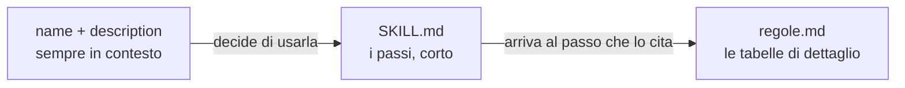
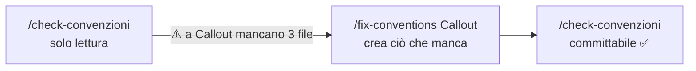

# Skills

Un lavoro che si ripete uguale, scritto una volta

---

## Una skill è una cartella

```text
.claude/skills/check/SKILL.md
```

```markdown [1-4|6-10]
--- 
name: check
description: Lancia typecheck e lint e riporta gli errori senza correggerli. Usala prima di un commit. Trigger: fai il check, è tutto verde, controlla che compili.
--- 

# Il progetto compila?

1. Lancia `npm run check`.
2. Se è rosso, riporta ogni errore come `file:riga — messaggio`.
3. Non correggere niente: chi ha scritto il codice decide.
```

Un frontmatter e dei passi. **Tutto qui.**

---

## Tre cose da sapere

1. **La cartella dà il nome** alla skill
2. **La `description` decide quando parte.** Non le istruzioni: la description
3. **Le istruzioni sono passi concreti** su questa codebase, con file veri, non consigli generici

<div class="box">

Se una skill non si attiva mai, il problema è **sempre** la `description`.

</div>

Note: la seconda è quella che sbagliano tutti. Claude sceglie le skill leggendo solo nome e description: il corpo lo carica dopo, quando ha già deciso di usarla.

---

## La description dice **quando**, non **cosa**

<div class="cols">
<div class="col">

**✗ descrive la skill**

```yaml
description: Skill per la gestione
  dei componenti della libreria.
```

</div>
<div class="col">

**✓ dice quando partire**

```yaml
description: Aggiunge un componente
  alla libreria toccando i cinque file.
  Trigger: crea un componente, nuovo
  componente, mi serve un componente,
  aggiungi alla libreria.
```

</div>
</div>

Frasi **vere**, quelle che una persona scriverebbe davvero. È la riga che conta di più.

---

## Due modi di lanciarla

<div class="cols">
<div class="col">

**Una frase normale**

> mi serve un componente Avatar nella libreria

Decide **Claude**, dalla `description`. Vedi comparire `Skill(new-component)`.

</div>
<div class="col">

**Per nome**

```text
/new-component Tooltip
```

Decidi **tu**. Più veloce, non dipende dalla `description`.

</div>
</div>

- `/` da solo elenca tutte le skill disponibili
- le skill si caricano all'avvio: dopo una modifica, **`/reload-skills`** o riavvia

---

## `allowed-tools` e `$ARGUMENTS`

```yaml
allowed-tools: Read, Grep, Glob, Bash(npm run:*)
```

- gli strumenti che Claude usa **senza chiederti il permesso** mentre la skill gira
- `Bash(npm run:*)`: solo comandi che cominciano con `npm run`
- è un'**autorizzazione, non un muro**: fuori lista, Claude deve chiedere

```text
/fix-conventions Callout      → $ARGUMENTS = "Callout"
/fix-conventions              → $ARGUMENTS vuoto: tutta la libreria
```

Note: una skill che deve solo guardare non ha Write né Edit. Se prova a sistemare qualcosa, compare una richiesta di permesso: è il segnale che sta uscendo dal suo compito. Il muro vero arriva con i subagent.

---

## Progressive disclosure



```text
.claude/skills/check-convenzioni/
├── SKILL.md    ← max trenta righe, rimanda a regole.md
└── regole.md   ← cinque file, convenzioni, rules: come si verifica ognuna
```

Una skill **leggera senza essere superficiale**: il file grosso non entra nel contesto finché non serve.

---

## Il ciclo: trova → sistema → conferma



- **una fonte sola**: `fix-conventions` legge le regole da `regole.md` di `check-convenzioni`, non le ripete
- la parte che conta è **cosa non fa**: non cambia props né markup; se servirebbe, si ferma e chiede

<div class="box">

Una skill che ripara **senza confine** rompe più di quanto sistema.

</div>

---

## Skill scritte da altri

```bash
npx skills add anthropics/skills@frontend-design -y
```

- installata **nel progetto**: agli altri arriva con un `git pull`
- **committa l'installazione prima di lanciarla**: così il diff dopo mostra solo il suo lavoro
- una skill esterna è brava e **non conosce il tuo contratto**

```bash
git status --short   # ha toccato solo i file che le avevi dato?
git diff --stat      # 50 righe plausibili, 300 no
npm run check        # un prop rinominato fa esplodere il typecheck
```

Note: dal workshop in team. Nessun designer in squadra: il gusto visivo non è una procedura, è un mestiere, e non ha senso scriverselo in dieci minuti. Ma è l'unico momento in cui vale la pena leggere un diff riga per riga.

---

## Scrivere una buona skill

- **procedura, non descrizione**: passi numerati
- **percorsi veri** del progetto e un file esistente come modello
- **cosa non fare**: la prima bozza ne dice sempre troppo poco
- **output fisso**: una riga di verdetto, non un saggio
- **corta**: trenta, quaranta, cinquanta righe al massimo

<div class="box">

Falla scrivere a Claude, poi **leggila e taglia**. Più una procedura è lunga, meno fa quello che credi.

</div>
