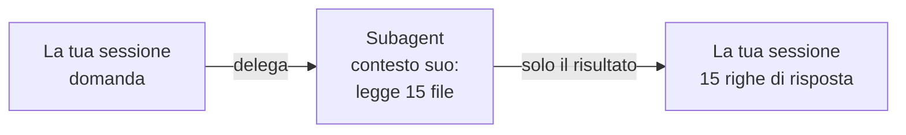

# Subagent

Delegare un lavoro, ricevere solo la conclusione

---

## Skill o subagent?

Una **skill** è un insieme di istruzioni che entra nella **tua** sessione.

Un **subagent** è qualcun altro: ha il **suo contesto**, fa il lavoro per conto suo, e ti riporta solo la conclusione.



Note: la differenza conta quando il lavoro richiede di leggere molto. Una skill che facesse la stessa cosa riempirebbe la sessione del contenuto di quei quindici file, e dopo tre giri si è a corto di spazio.

---

## Un agente è un file

```text
.claude/agents/auditor.md
```

```markdown [1-6|8-11]
--- 
name: auditor
description: Passa in rassegna la libreria e riferisce com'è messa. Trigger: com'è messa la libreria, passa in rassegna i componenti, fammi un audit.
model: sonnet
tools: Read, Glob, Grep
--- 

Leggi ogni componente in src/components/, controlla i cinque file
e le convenzioni di CLAUDE.md. Riferisci in massimo quindici righe:
una per componente, poi i problemi. Non sistemare niente.
```

Stessa forma di una skill. Due campi nuovi: **`model`** e **`tools`**.

---

## `tools`: questa volta è un muro

- l'auditor **non ha `Write` né `Edit`**: non è una raccomandazione, è che **non ne dispone**
- un agente che deve solo guardare **non deve poter toccare**
- se Claude gli ha dato anche `Write` o `Bash`, **toglili tu**

| | Cosa limita | Quanto è forte |
|---|---|---|
| `allowed-tools` in una skill | cosa gira **senza chiedere** | autorizzazione |
| `tools` in un agente | cosa **esiste** per lui | muro |

---

## Quando il tool serve, ma è largo

Un agente `stats` che conta righe e commit ha bisogno di `Bash`. Ma con `Bash` si può anche committare o cancellare.

```yaml
model: haiku
tools: Read, Glob, Grep, Bash
```

Allora il confine va **nelle istruzioni**:

> Usa solo comandi che leggono — `git log`, `git rev-list`, `wc`, `find`, `ls`.
> **Mai** `git commit`, `git checkout`, `rm`.

- `model: haiku`: contare non richiede un modello grande. **Più veloce, costa meno**

Note: sono i due modi di limitare un agente: nel campo tools, o nelle istruzioni quando il tool serve ed è largo.

---

## I numeri di un agente si verificano

> com'è messo il progetto in numeri?

Ti torna una tabella. Due numeri li controlli **a mano**:

```bash
git rev-list --count HEAD         # commit totali
ls -d src/components/*/ | wc -l   # componenti
```

Se non tornano, guarda **cosa ha lanciato** e stringi le istruzioni.

---

## Un esempio dal lavoro in team: `smoke-test`

```yaml
name: smoke-test
description: Verifica che tutte le pagine del sito rispondano.
tools: Bash
```

- una `curl` su ogni rotta, una tabella **rotta → codice HTTP**
- chiude con **TUTTO OK**, oppure l'elenco delle rotte che non rispondono 200
- **non avvia il dev server**: se non risponde niente, lo dice e basta

Lavoro **rumoroso** in un contesto separato, a te torna solo il verdetto. Lo scrive uno, **lo usa tutta la squadra**.

---

## La domanda da farsi

<div class="box">

**Mi serve vedere i passaggi, o solo la risposta?**

</div>

| | |
|---|---|
| **Skill** | istruzioni nel tuo contesto, vedi tutto quello che succede |
| **Subagent** | lavoro delegato, contesto separato, ti torna solo il risultato |
