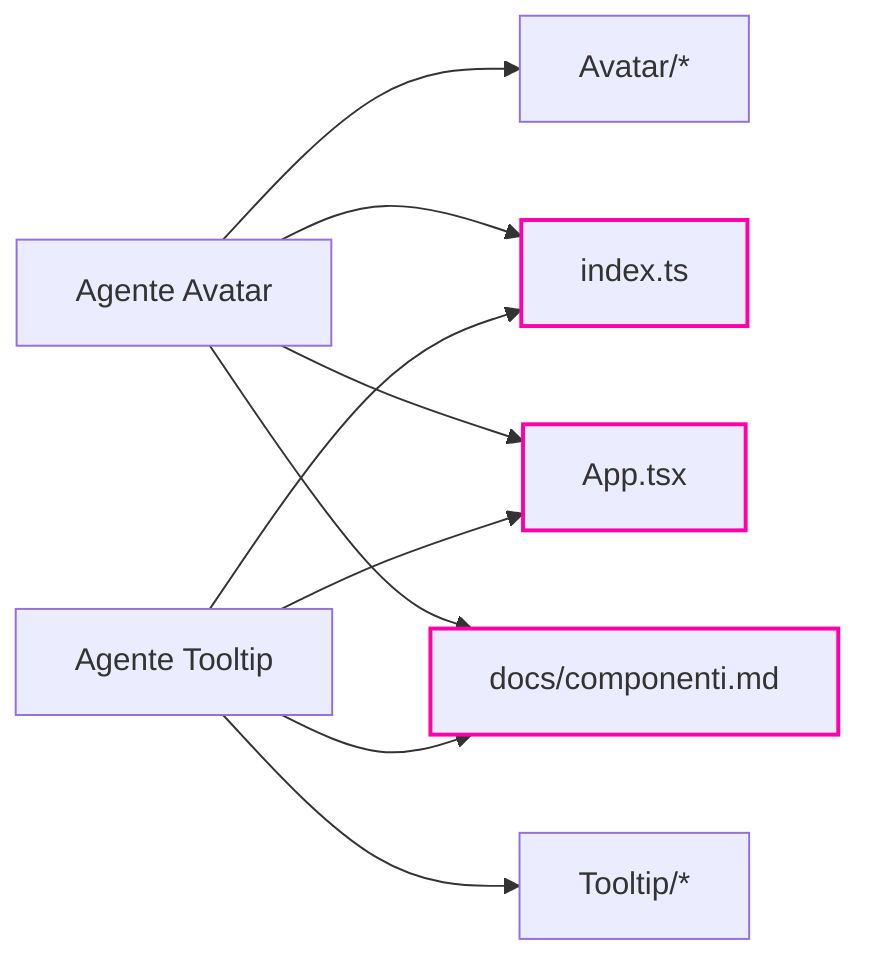

# Agenti in parallelo

Il tempo del più lento, non la somma

---

## Lanciarli insieme

```text
Lancia due agenti in parallelo: uno aggiunge il componente Avatar alla libreria,
l'altro aggiunge Tooltip. Ognuno tocca tutti e cinque i file.
```

Due `Agent(…)` uno sotto l'altro, che lavorano **nello stesso momento**.

Se due lavori non dipendono l'uno dall'altro, il tempo è quello del **più lento**.

<div class="box">

Ma «non dipendono l'uno dall'altro» è una frase **da guardare bene**. È l'esercizio.

</div>

---

## Indipendenti nel contenuto, non nei file



Due mani sullo stesso file, nello stesso momento, **non possono sapere l'una dell'altra**.

---

## Quattro esiti possibili

- **Tutto verde.** Il più probabile: ogni agente ha riletto i file condivisi un attimo prima di scrivere
- **Uno manca dalla vetrina.** Un agente ha sovrascritto l'altro → `/fix-conventions`
- **`npm run check` rosso.** Stessa causa, più rumorosa: export doppio, import rotto
- **Una regola non rispettata.** Non è una collisione: la regola con `paths` si carica quando Claude *apre* un file, e chi **crea** un file da zero può non aprirne nessuno

Note: il passo 8 del workshop può finire male ed è previsto. Il punto non è quale esito si ottiene, è capire perché.

---

## Si controlla con gli strumenti che hai

Non a occhio.

```bash
npm run check
```

```text
/check-convenzioni
```

```text
Avatar   ✅
Badge    ✅
Callout  ✅
Tooltip  ⚠️  l'elemento più esterno è uno <span>, non rispetta ui.md
```

Le skill che hai scritto prima diventano la **rete di sicurezza** del lavoro parallelo.

---

## Parallelizzare bene

- dividi per **file**, non solo per argomento
- i file condivisi (registri, indici, rotte) sono il punto di **collisione**
- in team la stessa idea si chiama **aree di proprietà**: ognuno ha i suoi file, il contratto è congelato
- una volta finito: **verifica automatica**, poi commit

<div class="box">

Tre persone o tre agenti, il problema è lo stesso: **chi scrive dove**.

</div>

Note: nel workshop in team i tre track sono pensati per non dipendere l'uno dall'altro, e il contratto (tipi, rotte, firme dei componenti) si discute solo all'inizio. Dopo è congelato. È lo stesso principio che rende sicuro il parallelo con gli agenti.
