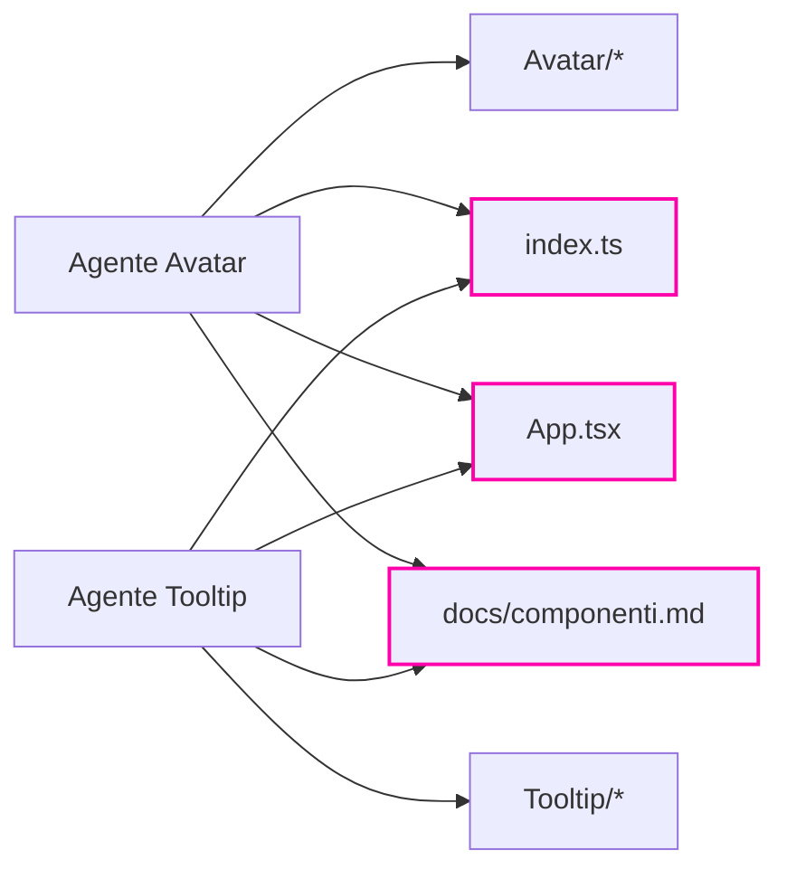
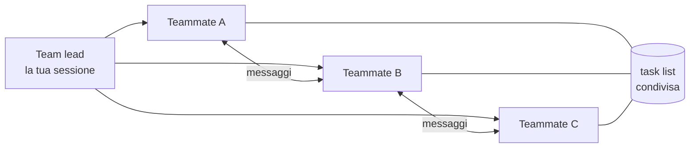
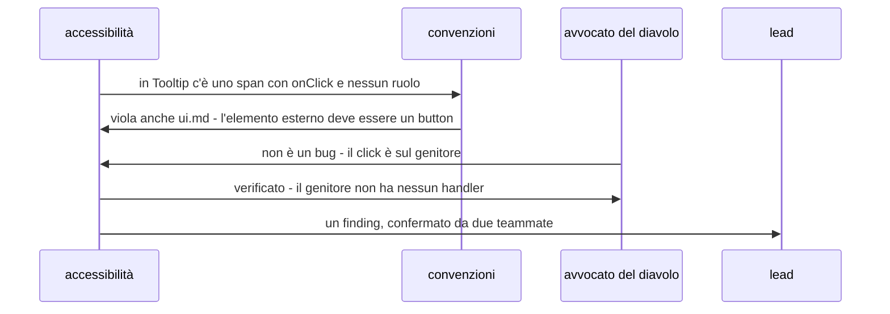
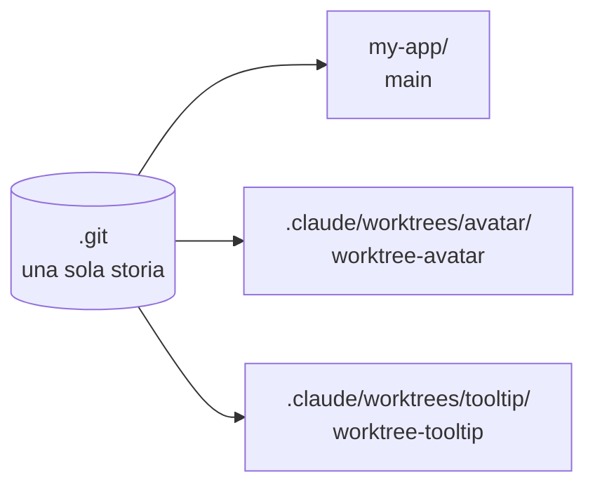

# Agenti in parallelo

Il tempo del più lento, non la somma

---

## Lanciarli insieme

```text
Lancia due agenti in parallelo: uno aggiunge il componente Avatar alla libreria,
l'altro aggiunge Tooltip. Ognuno tocca tutti e cinque i file.
```

Due `Agent(…)` uno sotto l'altro, che lavorano **nello stesso momento**.

Se due lavori non dipendono l'uno dall'altro, il tempo è quello del **più lento**.

<div class="box">

Ma «non dipendono l'uno dall'altro» è una frase **da guardare bene**. È l'esercizio.

</div>

---

## Indipendenti nel contenuto, non nei file


```mermaid
flowchart LR
  A1[Agente Avatar] --> AV[Avatar/*]
  A2[Agente Tooltip] --> TT[Tooltip/*]
  A1 --> IDX[index.ts]
  A2 --> IDX
  A1 --> APP[App.tsx]
  A2 --> APP
  A1 --> DOC[docs/componenti.md]
  A2 --> DOC
  style IDX stroke:#f0a,stroke-width:2px
  style APP stroke:#f0a,stroke-width:2px
  style DOC stroke:#f0a,stroke-width:2px
```

Due mani sullo stesso file, nello stesso momento, **non possono sapere l'una dell'altra**.

---

## Quattro esiti possibili

- **Tutto verde.** Il più probabile: ogni agente ha riletto i file condivisi un attimo prima di scrivere
- **Uno manca dalla vetrina.** Un agente ha sovrascritto l'altro → `/fix-conventions`
- **`npm run check` rosso.** Stessa causa, più rumorosa: export doppio, import rotto
- **Una regola non rispettata.** Non è una collisione: la regola con `paths` si carica quando Claude *apre* un file, e chi **crea** un file da zero può non aprirne nessuno

Note: il passo 8 del workshop può finire male ed è previsto. Il punto non è quale esito si ottiene, è capire perché.

---

## Si controlla con gli strumenti che hai

Non a occhio.

```bash
npm run check
```

```text
/check-convenzioni
```

```text
Avatar   ✅
Badge    ✅
Callout  ✅
Tooltip  ⚠️  l'elemento più esterno è uno <span>, non rispetta ui.md
```

Le skill che hai scritto prima diventano la **rete di sicurezza** del lavoro parallelo.

---

## Parallelizzare bene

- dividi per **file**, non solo per argomento
- i file condivisi (registri, indici, rotte) sono il punto di **collisione**
- in team la stessa idea si chiama **aree di proprietà**: ognuno ha i suoi file, il contratto è congelato
- una volta finito: **verifica automatica**, poi commit

<div class="box">

Tre persone o tre agenti, il problema è lo stesso: **chi scrive dove**.

</div>

Note: nel workshop in team i tre track sono pensati per non dipendere l'uno dall'altro, e il contratto (tipi, rotte, firme dei componenti) si discute solo all'inizio. Dopo è congelato. È lo stesso principio che rende sicuro il parallelo con gli agenti.

---

## Gli agenti built-in

Claude Code ha già degli agenti pronti: **non li scrivi tu**.

| Agente | Cosa fa | Tool |
|---|---|---|
| `Explore` | cerca e legge il codebase, veloce | **solo lettura** |
| `Plan` | raccoglie contesto prima di scrivere un piano (plan mode) | **solo lettura** |
| `general-purpose` | compiti in più passi: esplora **e** modifica | tutti |

Claude li sceglie **da solo** quando un compito è adatto. Nel terminale li vedi come `Agent(Explore)`.

Note: Explore e Plan saltano CLAUDE.md e git status per costare poco. Solo lettura vuol dire nessun effetto collaterale: per questo Claude li usa liberamente.

---

## Usare i built-in apposta

```text
Usa l'agente Explore, very thorough: dove costruiamo classi Tailwind
con template string dentro className?
```

- `Explore` ha tre livelli: **quick**, **medium**, **very thorough**
- la ricerca resta **nel suo contesto**: a te torna solo la risposta
- stesso nome, file tuo: un agente chiamato `Explore` in `.claude/agents/` **sostituisce** quello built-in

<div class="box">

Prima di scrivere un agente che "cerca nel codice", controlla se `Explore` lo fa già.

</div>

---

## Agent teams: lo _swarm_


```mermaid
flowchart LR
  L["Team lead<br/>la tua sessione"] --> T1[Teammate A]
  L --> T2[Teammate B]
  L --> T3[Teammate C]
  T1 <-->|messaggi| T2
  T2 <-->|messaggi| T3
  T1 & T2 & T3 --- TL[("task list<br/>condivisa")]
```

- ogni teammate è **un'istanza separata di Claude Code**, con il suo contesto
- **si parlano tra loro**, non solo con il lead
- **prendono i task** da una lista condivisa, con dipendenze

**Sperimentale**: disattivato di default.

---

## Avviare un team

```json
// .claude/settings.json
{ "env": { "CLAUDE_CODE_EXPERIMENTAL_AGENT_TEAMS": "1" } }
```

```text [1-4|6]
Crea un agent team di tre teammate per passare in rassegna la libreria:
- uno controlla l'accessibilità
- uno le convenzioni di CLAUDE.md
- uno fa l'avvocato del diavolo

Fate in modo che si contestino a vicenda.
```

Senza l'ultima riga **bastano tre subagent**.

- i teammate compaiono **sotto il prompt**: `↑` `↓` per sceglierne uno, `Invio` per aprirlo e parlargli direttamente
- `Ctrl+T` mostra la task list
- per chiudere: _"chiedi ai teammate di chiudersi"_

Note: i teammate caricano CLAUDE.md, skill e MCP, ma non la conversazione del lead: il contesto che serve va nel prompt con cui li crei. Con tmux o iTerm2 ogni teammate può avere il suo pannello.

---

## Cosa succede dentro


```mermaid
sequenceDiagram
  participant A as accessibilità
  participant C as convenzioni
  participant D as avvocato del diavolo
  participant L as lead
  A->>C: in Tooltip c'è uno span con onClick e nessun ruolo
  C->>A: viola anche ui.md - l'elemento esterno deve essere un button
  D->>A: non è un bug - il click è sul genitore
  A->>D: verificato - il genitore non ha nessun handler
  A->>L: un finding, confermato da due teammate
```

- **si scrivono per nome**, senza passare dal lead
- un finding che sopravvive a una contestazione **vale di più**
- il lead riceve **una conclusione già discussa**, non tre liste da confrontare

Note: uno scambio illustrativo, non una trascrizione reale. Con i subagent in parallelo nessuna di queste frecce tra teammate potrebbe esistere: ognuno riferisce solo all'agente principale.

---

## Subagent o team?

| | Subagent in parallelo | Agent team |
|---|---|---|
| Si parlano | no, riferiscono all'agente principale | **sì**, direttamente |
| Chi coordina | tu, **prima** di lanciarli | il lead e i teammate, **mentre** lavorano |
| Costo | più basso | **più alto**: ogni teammate è una sessione intera |
| Stato | stabile | sperimentale |

- un team conviene quando gli agenti devono **condividere scoperte e contestarsi**: ricerca, review
- **3–5 teammate**, e il problema dei file resta: due teammate sullo stesso file si sovrascrivono

---

## Sessioni parallele

Non agenti lanciati da Claude: **più sessioni `claude`**, lanciate da te.

```bash
claude -w avatar     # sessione 1 → .claude/worktrees/avatar/
claude -w tooltip    # sessione 2 → .claude/worktrees/tooltip/
```

- `-w` (`--worktree`) dà a ogni sessione **la sua copia del repo**, sul suo branch: niente collisioni sui file
- le coordini tu, e alla fine fai il merge dei branch
- `claude agents` mostra tutte le sessioni in background in un'unica vista (**research preview**)

<div class="box">

I subagent condividono i tuoi file. I worktree **no**: il modo più robusto per lavorare in parallelo.

</div>

---

## Cos'è un worktree


```mermaid
flowchart LR
  G[(".git<br/>una sola storia")] --> M["my-app/<br/>main"]
  G --> A[".claude/worktrees/avatar/<br/>worktree-avatar"]
  G --> T[".claude/worktrees/tooltip/<br/>worktree-tooltip"]
```

- è git puro (`git worktree`): **più cartelle, un solo repo**, ogni cartella sul suo branch
- **non è un clone**: la storia è condivisa, quindi è veloce e leggero
- `claude -w avatar` crea la cartella e il branch `worktree-avatar`, poi avvia Claude **lì dentro**
- all'uscita: un worktree non toccato viene rimosso, uno con modifiche **chiede** se tenerlo

Note: il branch parte dal branch di default del repository. Anche i subagent possono averne uno, con `isolation: worktree` nel frontmatter: un worktree temporaneo, rimosso se l'agente non ha cambiato niente.

---

## Worktree: pro e contro

<div class="cols">
<div class="col">

**Pro**

- **niente collisioni** mentre lavorano: ogni sessione scrive nella sua cartella
- un branch per compito: **review, merge o via** ognuno per conto suo
- costa poco: storia condivisa, nessun clone
- funziona anche per i subagent: `isolation: worktree`

</div>
<div class="col">

**Contro**

- i file ignorati non ci sono: **`node_modules`, `.env`** → `npm install` in ogni worktree
- due dev server sulla stessa **porta** si scontrano
- il merge dei branch alla fine **lo fai tu**
- più cartelle e branch da tenere d'occhio

</div>
</div>

<div class="box">

I worktree separano i **file**, non il **contratto**: due branch che toccano entrambi `index.ts` vanno comunque in conflitto, al momento del merge.

</div>
