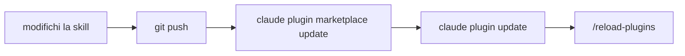

# Plugin

La scatola per portare skill e agenti ovunque

---

## Dove vive una skill, e chi la vede

| Dove sta | Chi la vede |
|---|---|
| `~/.claude/skills/` | solo tu, in tutti i tuoi progetti |
| `.claude/skills/` nel repo | chi clona il repo |
| in un **plugin** | chiunque lo installi, in ogni progetto |

- un **plugin** è una cartella con skill, agenti (e hook) dentro
- un **marketplace** è l'elenco da cui si installa: una cartella locale o un repo GitHub

---

## Installare un plugin da GitHub

```bash
claude plugin marketplace add trainingfb/claude-fb-marketplace-demo-workshop --scope project
claude plugin install git@claude-fb-marketplace-demo-workshop --scope project
claude plugin list | grep -A3 "git@"
```

- **`plugin@marketplace`**: sono i `name` scritti nei JSON, non i nomi delle cartelle
- **`--scope project`**: finisce in `.claude/settings.json`, si committa, **chi clona se lo ritrova**
- senza `--scope` il default è `user`: vale per te, non arriva a nessun altro

Note: il plugin del workshop si chiama git, e ha due skill che valgono in qualunque repo: commit (check, messaggio dal diff, commit) e pr (commit, push, pull request in draft).

---

## Usarlo

Le skill di un plugin si chiamano come le tue: con una frase normale, oppure con il **prefisso del plugin**.

```text
/git:commit
/git:pr
```

`/git:commit` lancia `npm run check`, legge il diff, scrive il messaggio. **Se il check fallisce si ferma**, e ti dice perché.

- dopo un'installazione o un aggiornamento: **`/reload-plugins`** o riavvia

---

## Costruirne uno

```text
mariorossi-plugins/
├── .claude-plugin/
│   ├── plugin.json         ← come si chiama il plugin
│   └── marketplace.json    ← l'elenco da cui si installa
└── skills/
    └── folder-info/
        └── SKILL.md
```

<div class="cols">
<div class="col">

```json
{
  "name": "dev-tools",
  "version": "1.0.0",
  "author": { "name": "Mario Rossi" }
}
```

</div>
<div class="col">

```json
{
  "name": "mariorossi-plugins",
  "owner": { "name": "Mario Rossi" },
  "plugins": [
    { "name": "dev-tools", "source": "./" }
  ]
}
```

</div>
</div>

Note: la cartella del plugin non va dentro il progetto: non è codice di quel progetto, è roba tua che vale ovunque.

---

## Cosa va in un plugin

<div class="box">

In un plugin ci va **quello che vale ovunque**. Il resto sta bene dov'è, in `.claude/skills/`.

</div>

- `new-component`, `check-convenzioni` parlano di `src/components/` e dei cinque file: **restano nel progetto**
- `folder-info` misura una cartella qualsiasi, non nomina nessun file del progetto: **va nel plugin**
- `commit`, `pr`, `ship`: il flusso git è uguale in ogni repo: **plugin**

---

## Valida, installa, prova

```bash
claude plugin validate ./mariorossi-plugins --strict     # Validation passed

claude plugin marketplace add ./mariorossi-plugins
claude plugin install dev-tools@mariorossi-plugins
```

```text
/dev-tools:folder-info src
```

- `--strict` è più severo del necessario: è quello che vuoi **prima di darlo ad altri**
- il `name` del marketplace **non può iniziare con `claude`**
- una skill modificata **non viene vista** dalla sessione aperta: `/reload-plugins`

---

## Il ciclo di aggiornamento



Un push **non arriva a nessuno** finché non lo tira giù. Chi usa il plugin aggiorna quando vuole.

Note: pubblicare su GitHub è facoltativo nel workshop. Serve un repo con .claude-plugin/marketplace.json nella radice. Il test onesto è installarlo dal remoto, non dalla cartella locale.
