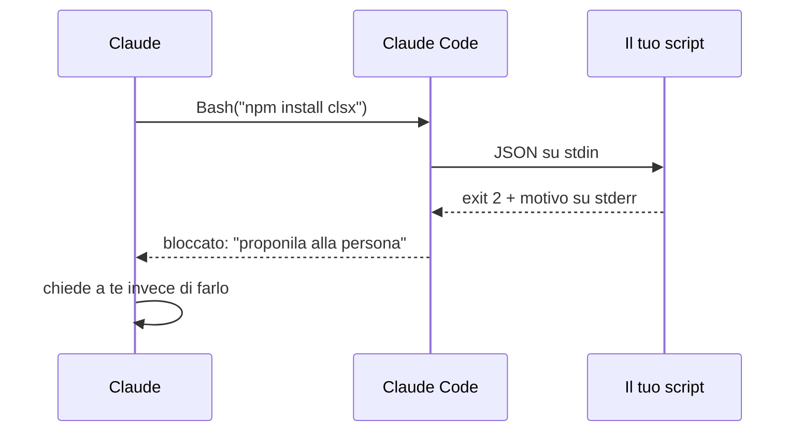

# Hooks

Quello che non deve succedere mai

---

## Una regola si chiede, un hook si impone

<div class="cols">
<div class="col">

**Regola**

«Non aggiungere dipendenze senza chiedere.»

Claude la legge e **decide** di rispettarla. Quasi sempre lo fa, ma resta **una sua decisione**.

</div>
<div class="col">

**Hook**

Un **comando tuo** che Claude Code lancia prima o dopo un'azione, e che può fermarla.

**Non passa dal modello**: succede sempre.

</div>
</div>

---

## Come funziona



- **exit 0** → lascia fare
- **exit 2** → blocca, e quello che scrivi su **stderr** arriva a Claude come motivo

---

## Lo script

```js [1-5|7-12|14|16-21]
import { readFileSync } from "node:fs";

// Claude Code passa i dati dell'evento come JSON su stdin.
const { tool_input } = JSON.parse(readFileSync(0, "utf8"));
const comando = tool_input?.command ?? "";

// `npm install|i|add` seguiti da almeno un pacchetto.
// `npm install` da solo, che reinstalla quello che c'è, passa.
const trovato = comando.match(/\bnpm\s+(?:install|i|add)\b(.*)/);
const pacchetti = trovato
  ? trovato[1].trim().split(/\s+/).filter((p) => p && !p.startsWith("-"))
  : [];

if (pacchetti.length === 0) process.exit(0);

console.error(
  `Bloccato: \`${comando}\` aggiunge ${pacchetti.join(", ")} al progetto. ` +
    "Qui le dipendenze non si aggiungono senza chiedere: proponila alla persona.",
);
process.exit(2);
```

`.claude/hooks/niente-dipendenze.mjs`

---

## Provalo senza Claude

```bash
echo '{"tool_input":{"command":"npm install clsx"}}' \
  | node .claude/hooks/niente-dipendenze.mjs; echo $?     # messaggio, poi 2

echo '{"tool_input":{"command":"npm run check"}}' \
  | node .claude/hooks/niente-dipendenze.mjs; echo $?     # niente, poi 0
```

<div class="box">

Un hook rotto **blocca tutto o non blocca niente**, e non te lo dice. Provalo a mano prima.

</div>

Note: il secondo caso è di gran lunga il più frequente. L'hook parte a OGNI comando Bash e quasi sempre deve lasciar passare senza fiatare. Su PowerShell il codice lo dà echo $LASTEXITCODE.

---

## Registralo in `.claude/settings.json`

```json [2|3|5|6-9]
{
  "hooks": {
    "PreToolUse": [
      {
        "matcher": "Bash",
        "hooks": [
          { "type": "command",
            "command": "node \"$CLAUDE_PROJECT_DIR\"/.claude/hooks/niente-dipendenze.mjs" }
        ]
      }
    ]
  }
}
```

- **evento**: `PreToolUse`, `PostToolUse`, `Stop`, `SessionStart`…
- **`matcher`**: lo strumento. `Bash`, oppure `Edit|Write`. Maiuscole contano
- **`$CLAUDE_PROJECT_DIR`**: la radice, anche se Claude è in una sottocartella
- `/hooks` nella sessione per controllare che sia stato letto

---

## Il risultato

> installa clsx e usalo in Button per comporre le classi

Claude prova `npm install clsx`, il comando **non parte**, riceve il tuo messaggio, e ti chiede se vuoi aggiungerla.

<div class="box">

Non ha obbedito: **non ha potuto**.

</div>

- vale anche con i permessi disattivati, e per i subagent
- `settings.json` si committa: vale per il team. Per un hook solo tuo: `settings.local.json`

---

## L'altro uso: fare, in silenzio

Un hook `PostToolUse` su `Edit|Write` che lancia il **linter sul file appena toccato**:

- pulito → niente
- errore → arriva a Claude **subito**, lo sistema al volo invece che alla fine

```js
appendFileSync(".claude/hooks/hook.log", `${new Date().toISOString()} lint ${file} → ${esito.status}\n`);
```

Un hook che non blocca **non si vede**: lascia una traccia in un log, o non saprai mai se è partito.

<div class="box">

`PostToolUse` arriva a modifica fatta: può **segnalare**, non impedire. Per impedire serve `PreToolUse`.

</div>
