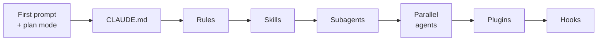

# Claude Code — the fundamentals

CLAUDE.md · rules · skills · agents · plugins · hooks

---

<!-- disabled -->

<!-- .slide: class="author-slide" -->

<div class="author-photo">
  
  
</div>

<div class="author-bio">
  <h1>Fabio Biondi</h1>
  <ul>
    <li>What you do</li>
    <li>What you are <strong>known for</strong></li>
    <li>Where people can find you</li>
  </ul>
  <p class="author-meta">❤️ <strong>fabiobiondi.dev</strong></p>
</div>

Note: disabled until you put your real photos in assets/author/ and write the bio. Remove the "disabled" line to bring it back.

---

## The problem

Claude Code **can write code**.

What it doesn't know is **how things are done in your project**:

- which files to touch
- what is never done
- what gets repeated the same way every time

<div class="box">

Today we learn to tell it **once**, instead of repeating it in every prompt.

</div>

Note: the model doesn't change during the course. The project does: by the end it works with Claude better than now, because we explained how it works in the format Claude reads.

---

## Four ways to tell Claude how to work

| | When it acts | Who decides |
|---|---|---|
| **Rule** | always, it lives in the context | Claude, which reads and applies it |
| **Skill** | when needed, for a repeated task | Claude from the `description`, or you with `/` |
| **Subagent** | for isolated work, with its own context | Claude, or you asking for it |
| **Hook** | on a specific event, before or after an action | nobody: it just happens |

A **plugin** is not a fifth way: it's the **box** you use to carry skills and agents into every repo, and to hand them to others.

Note: this is the map for the whole day. We come back to this table at the end, and by then every row will have an example you've seen working.

---

## The path



Each step **builds on the previous one**. By the end it all lives in the same project.

Note: the common thread is an empty React project (Vite) that grows into a small component library with a showcase. No downloaded code: everything inside it was built by whoever follows the path.

---

## What you need

```bash
node -v            # 20 or later
claude --version   # npm install -g @anthropic-ai/claude-code
```

- an editor with an **integrated terminal**
- **two terminals** always open: `npm run dev` and `claude`
- (in a team) **a third one**, for `git` and `npm run check` by hand
- **git** from minute one: every step ends with a commit

Note: I recommend sticking with Sonnet for the exercises: they are tuned to finish fast, and burning through usage limits at home means arriving in class without any.
