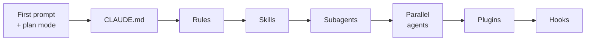

# Claude Code: _the fundamentals_

## CLAUDE.md · rules · skills · agents · plugins · hooks


#### [_fb-talks.github.io/claude-fundamentals_](https://fb-talks.github.io/claude-fundamentals/)

---

<!-- .slide: class="author-slide" -->

<div class="author-photo">
  
  
  
  
  
  
  
</div>

<div class="author-bio">
  <h1>Fabio Biondi</h1>
  <ul>
    <li>Freelance</li>
    <li>AI Gen & Front-end <strong>Training for Teams</strong></li>
    <li><strong>Google Developer Expert (Angular)</strong></li>
    <li><strong>Speaker</strong> &amp; Content Creator</li>
    <li><strong>Community</strong> Founder</li>
    <li><strong>LearnByDo.ing</strong> creator</li>
  </ul>

  <p class="author-meta">Main Skills: TypeScript · Angular · React · Next.js · Gemini · Claude</p>
  <p class="author-meta">❤️ MTB · Snowboard · Tennis · Skate — <strong>FabioBiondi.dev</strong></p>

<br />

## _fabiobiondi.dev_

</div>

Note: thirty seconds, no more.

---

## The problem

Claude Code **can write code**.

What it doesn't know is **how things are done in your project**:

- which files to touch
- what is never done
- what gets repeated the same way every time

<div class="box">

Today we learn to tell it **once**, instead of repeating it in every prompt.

</div>

Note: the model doesn't change during the course. The project does: by the end it works with Claude better than now, because we explained how it works in the format Claude reads.

---

## Four ways to tell Claude how to work

| | When it acts | Who decides |
|---|---|---|
| **Rule** | always, it lives in the context | Claude, which reads and applies it |
| **Skill** | when needed, for a repeated task | Claude from the `description`, or you with `/` |
| **Subagent** | for isolated work, with its own context | Claude, or you asking for it |
| **Hook** | on a specific event, before or after an action | nobody: it just happens |

A **plugin** is not a fifth way: it's the **box** you use to carry skills and agents into every repo, and to hand them to others.

Note: this is the map for the whole day. We come back to this table at the end, and by then every row will have an example you've seen working.

---

## The path


```mermaid
flowchart LR
  A[First prompt<br/>+ plan mode] --> B[CLAUDE.md]
  B --> C[Rules]
  C --> D[Skills]
  D --> E[Subagents]
  E --> F[Parallel<br/>agents]
  F --> G[Plugins]
  G --> H[Hooks]
```

Each step **builds on the previous one**. By the end it all lives in the same project.

Note: the common thread is an empty React project (Vite) that grows into a small component library with a showcase. No downloaded code: everything inside it was built by whoever follows the path.

---

## What you need

```bash
node -v            # 20 or later
claude --version   # npm install -g @anthropic-ai/claude-code
```

- an editor with an **integrated terminal**
- **two terminals** always open: `npm run dev` and `claude`
- (in a team) **a third one**, for `git` and `npm run check` by hand
- **git** from minute one: every step ends with a commit

Note: I recommend sticking with Sonnet for the exercises: they are tuned to finish fast, and burning through usage limits at home means arriving in class without any.
