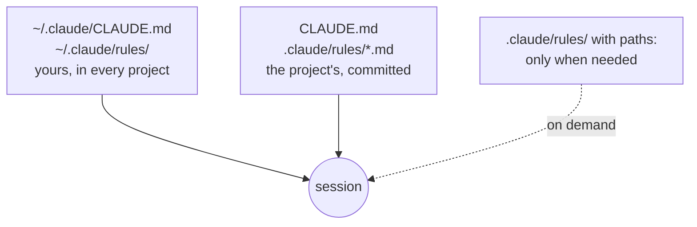

# Rules

Rules that grow, without bloating CLAUDE.md

---

## A rule or a wish?

<div class="cols">
<div class="col">

**Useless**

- Write clean code
- Type things properly
- Follow best practices

</div>
<div class="col">

**They work**

- Named exports, never `default`
- Props live in an exported `interface <Name>Props`
- Styles live in `<Name>.css`, no inline `style`

</div>
</div>

<div class="box">

The test: **looking at the code, does this rule let me answer yes or no?**
If not, it's not a rule. It's a wish.

</div>

Note: the two lists mean roughly the same thing. But "clean" according to whom? Claude will do what looks clean to it, not what you meant.

---

## `.claude/rules/`: one file per topic

```text
.claude/
└── rules/
    ├── api.md       ← how components are used from outside
    ├── ui.md        ← rules inside components
    └── testing.md   ← …and so on, as they grow
```

- Claude loads **every** `.md` in the folder, at startup
- same priority as `CLAUDE.md`, **no configuration**
- add a file and it applies

`CLAUDE.md` stays **short**: the map. The details grow here.

---

## The shape of a rule

```markdown
# Component API

- **A component's visible text comes from `children`.**
  No `text`, `label` or `content` prop: write `<Badge>New</Badge>`,
  not `<Badge text="New" />`. That way every component is used the same way.
```

- **the rule in bold**: checkable with a yes or a no
- **the why at the end**: half a sentence, helps Claude with edge cases
- written **by hand**: you decide the shape

Note: where does the rule come from? From the decision Claude made on its own for the Spinner, the one you'd have wanted to make yourself. The best rules come from a mistake you've seen, not from an abstract list.

---

## Rules that apply only to one part

```markdown [1-4|6-8]
--- 
paths:
  - "src/components/**/*.tsx"
--- 

# Component rules

- **The outermost element has `data-ui="<name>"`**, lowercase.
```

- without `paths`: loaded **at startup**, applies everywhere
- with `paths`: loaded only when Claude **opens** a matching file
- while you work on the docs, it **takes up no context**

Note: watch the edge case, we'll see it again with parallel agents: whoever creates a file from scratch may never open a matching one, and the rule with paths never loads.

---

## Where rules live



**Personal** ones in `~/.claude/`, **the team's** in the repo. Your own preferences shouldn't be imposed on others.

---

## A rule doesn't rewrite yesterday's code

Components born **before** the rule almost certainly don't follow it. It happens in every real project.

The answer is an alignment pass, **once**:

```text
Align Badge, Button and Stack with the rules in .claude/rules/. Change nothing else.
```

```bash
git diff --stat   # three files, few lines. More? git checkout . and tighten the prompt
```

---

## A rule, or something else?

- a **rule** applies **always**: it sits in every session's context, takes up space and has to be worth it
- a task that **repeats the same way**, with steps → **skill**
- a sentence starting with **"must never happen"** → a rule isn't enough: you need a **hook**

<div class="box">

**If you repeat it in every prompt, it's not an instruction: it's a rule.**

</div>

Note: the boxed sentence comes from the end of the team workshop: reopen the day's prompts and look for sentences repeated in more than one. Those are rules disguised as instructions.
