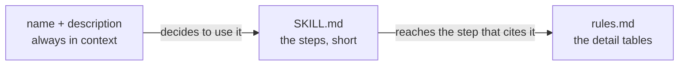
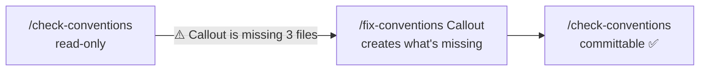

# Skills

A task that repeats the same way, written once

---

## A skill is a folder

```text
.claude/skills/check/SKILL.md
```

```markdown [1-4|6-10]
--- 
name: check
description: Runs typecheck and lint and reports errors without fixing them. Use it before a commit. Triggers: run the check, is everything green, make sure it compiles.
--- 

# Does the project compile?

1. Run `npm run check`.
2. If it's red, report every error as `file:line — message`.
3. Don't fix anything: whoever wrote the code decides.
```

A frontmatter and some steps. **That's it.**

---

## Three things to know

1. **The folder gives the skill its name**
2. **The `description` decides when it runs.** Not the instructions: the description
3. **The instructions are concrete steps** on this codebase, with real files, not generic advice

<div class="box">

If a skill never triggers, the problem is **always** the `description`.

</div>

Note: the second one is the one everybody gets wrong. Claude picks skills by reading only the name and description: it loads the body later, once it has already decided to use it.

---

## The description says **when**, not **what**

<div class="cols">
<div class="col">

**✗ describes the skill**

```yaml
description: Skill for managing
  the library's components.
```

</div>
<div class="col">

**✓ says when to run**

```yaml
description: Adds a component to
  the library, touching the five files.
  Triggers: create a component, new
  component, I need a component,
  add to the library.
```

</div>
</div>

**Real** sentences, the ones a person would actually type. It's the line that matters most.

---

## Two ways to run it

<div class="cols">
<div class="col">

**A normal sentence**

> I need an Avatar component in the library

**Claude** decides, from the `description`. You'll see `Skill(new-component)` appear.

</div>
<div class="col">

**By name**

```text
/new-component Tooltip
```

**You** decide. Faster, and it doesn't depend on the `description`.

</div>
</div>

- `/` on its own lists every available skill
- skills load at startup: after a change, **`/reload-skills`** or restart

---

## `allowed-tools` and `$ARGUMENTS`

```yaml
allowed-tools: Read, Grep, Glob, Bash(npm run:*)
```

- the tools Claude uses **without asking permission** while the skill runs
- `Bash(npm run:*)`: only commands starting with `npm run`
- it's a **permission, not a wall**: outside the list, Claude has to ask

```text
/fix-conventions Callout      → $ARGUMENTS = "Callout"
/fix-conventions              → $ARGUMENTS empty: the whole library
```

Note: a skill that should only look has no Write or Edit. If it tries to fix something, a permission prompt appears: that's the signal it's stepping outside its job. The real wall comes with subagents.

---

## Progressive disclosure



```text
.claude/skills/check-conventions/
├── SKILL.md    ← thirty lines max, points to rules.md
└── rules.md    ← five files, conventions, rules: how to check each one
```

A skill that's **light without being shallow**: the big file doesn't enter the context until it's needed.

---

## The loop: find → fix → confirm



- **one single source**: `fix-conventions` reads the rules from `check-conventions`' `rules.md`, it doesn't repeat them
- what matters is **what it doesn't do**: it doesn't change props or markup; if it would need to, it stops and asks

<div class="box">

A skill that fixes things **without boundaries** breaks more than it fixes.

</div>

---

## Skills written by others

```bash
npx skills add anthropics/skills@frontend-design -y
```

- installed **in the project**: the others get it with a `git pull`
- **commit the install before running it**: that way the diff afterwards shows only its work
- an external skill is good and **doesn't know your contract**

```bash
git status --short   # did it touch only the files you gave it?
git diff --stat      # 50 lines plausible, 300 not
npm run check        # a renamed prop blows up the typecheck
```

Note: from the team workshop. No designer on the team: visual taste isn't a procedure, it's a craft, and there's no point writing it down in ten minutes. But it's the one moment worth reading a diff line by line.

---

## Writing a good skill

- **procedure, not description**: numbered steps
- **real paths** from the project and an existing file as a model
- **what not to do**: the first draft always says too little
- **fixed output**: a one-line verdict, not an essay
- **short**: thirty, forty, fifty lines at most

<div class="box">

Have Claude write it, then **read it and cut**. The longer a procedure, the less it does what you think.

</div>
