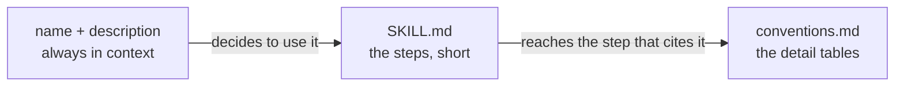
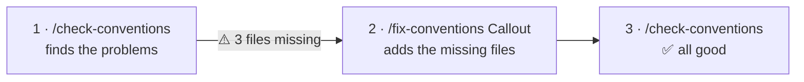

# Skills

A task that repeats the same way, written once

---

## The scenario

<div class="cols">
<div class="col">

1. After every prompt, the user runs  
   `npm run typecheck && npm run lint`
2. So they turn it into **one script** in `package.json`
3. And run `npm run check` **after every prompt**

</div>
<div class="col">

```json [7]
"scripts": {
  // ...
  "typecheck": "tsc -b --noEmit",
  "check": "npm run typecheck && npm run lint",
},
```

</div>
</div>

<div class="box">

Same command, same way, every time before the commit: 

that's a **skill** waiting to be written.

</div>

Note: start from the habit, not the feature. Everyone here already does this by hand; the next slide turns it into a skill.

---

## A skill is a folder

```text
.claude/skills/check/SKILL.md
```

```markdown [1-5|6-11]
--- 
name: check
description: Runs typecheck and lint and reports errors without fixing them. 
   Use it before a commit. Triggers: run the check, is everything green, make sure it compiles.
--- 

# Does the project compile?

1. Run `npm run check`.
2. If it's red, report every error as `file:line — message`.
3. Don't fix anything: whoever wrote the code decides.
```

A frontmatter and some steps. **That's it.**

---

## Three things to know

1. **The folder gives the skill its name**
2. **The `description` decides when it runs.** Not the instructions: the description
3. **The instructions are concrete steps** on this codebase, with real files, not generic advice

<div class="box">

If a skill never triggers, the problem is **always** the `description`.

</div>

Note: the second one is the one everybody gets wrong. Claude picks skills by reading only the name and description: it loads the body later, once it has already decided to use it.

---

## The description says **when**, not **what**

<div class="cols">
<div class="col">

**✗ describes the skill**

```yaml
description: Skill for managing
  the library's components.
```

</div>
<div class="col">

**✓ says when to run**

```yaml
description: Adds a component to
  the library, touching the five files.
  Triggers: create a component, new
  component, I need a component,
  add to the library.
```

</div>
</div>

**Real** sentences, the ones a person would actually type. It's the line that matters most.

---

## Skill: _new-component_


Note: Tutta la skill:

---

## New slide


- `/` on its own lists every available skill


- skills load at startup: after a change, **`/reload-skills`** or restart

---

## Two ways to run it

<div class="cols">
<div class="col">

**A normal sentence**

> I need an Avatar component in the library

**Claude** decides, from the `description`. You'll see `Skill(new-component)` appear.


</div>
<div class="col">

**By name**

```text
/new-component Tooltip
```

**You** decide. Faster, and it doesn't depend on the `description`.

</div>
</div>

---

## `allowed-tools`

```yaml
allowed-tools: Read, Grep, Glob, Bash(npm run:*)
```

- the tools Claude uses **without asking permission** while the skill runs
- `Bash(npm run:*)`: only commands starting with `npm run`
- it's a **permission, not a wall**: outside the list, Claude has to ask

Note: a skill that should only look has no Write or Edit. If it tries to fix something, a permission prompt appears: that's the signal it's stepping outside its job. The real wall comes with subagents.

---

## What are `Read`, `Grep`, `Glob`…?

- Claude doesn't touch your computer by itself: it **asks for a tool**, and Claude Code runs it
- every tool has a **name**, and it's the name you write in `allowed-tools` (skill) and `tools` (agent)
- you see them in the terminal while Claude works: `Read(src/index.ts)`, `Bash(npm run check)`

<div class="box">

Some tools **only look**, others **change** things. That's the difference that matters when you pick them.

</div>

---

## The main tools

| Tool | What it does | Example | Changes files? |
|---|---|---|---|
| `Read` | reads a file | `src/ui/Button/Button.tsx` | no |
| `Glob` | finds files **by name** | `src/**/*.example.tsx` | no |
| `Grep` | searches text **inside** files | `export default` | no |
| `Edit` | changes part of an existing file | renames a prop | **yes** |
| `Write` | creates or overwrites a whole file | `Callout.example.tsx` | **yes** |
| `Bash` | runs a terminal command | `npm run check` | **depends** on the command |
| `WebFetch` | reads a web page | a documentation URL | no |
| `WebSearch` | searches the web | "tailwind v4 dark mode" | no |

`Read, Grep, Glob` = look only. Add `Edit, Write` and it can change the code. `Bash(npm run:*)` narrows `Bash` to one family of commands.

---

## `$ARGUMENTS`

<div class="cols">
<div class="col">

**In `SKILL.md`**: a placeholder

```markdown [6]
--- 
name: fix-conventions
description: ...
--- 

The scope is $ARGUMENTS: one component.
If it's empty, the whole src/ui/ folder.
```

</div>
<div class="col">

**When you run it**: whatever follows the name

```text
/fix-conventions Callout
```

↓ Claude reads

```text
The scope is Callout: one component.
```

</div>
</div>

<div class="box">

Everything after the skill name replaces `$ARGUMENTS`. **Always write what happens when it's empty.**

</div>

Note: it's plain text substitution before Claude reads the skill, nothing more. /fix-conventions with nothing after it gives an empty string: that's why the second line of the instructions matters. If the skill doesn't contain $ARGUMENTS at all, Claude Code appends what you typed at the end as "ARGUMENTS: ...", so it isn't lost, but you don't control where it lands.

---

## More than one argument

<div class="cols">
<div class="col">

```markdown [4|7-8]
--- 
name: new-component
description: ...
argument-hint: <Name> <ModelComponent>
--- 

Create src/ui/$0/$0.tsx,
using src/ui/$1/$1.tsx as the model.
```


`argument-hint` is what shows up in the `/` menu while you type.


</div>
<div class="col">


```text
/new-component Tooltip Badge
```

| placeholder | value |
|---|---|
| `$ARGUMENTS` | `Tooltip Badge` |
| `$0` = `$ARGUMENTS[0]` | `Tooltip` |
| `$1` = `$ARGUMENTS[1]` | `Badge` |


</div>
</div>

Note: a value with spaces goes in quotes. Past two arguments, prefer a normal sentence: Claude understands it better than a positional list you have to remember.

---

## Skills Assets

```text
.claude/skills/check-conventions/
├── SKILL.md          ← thirty lines max, points to conventions.md
└── conventions.md    ← five files, conventions, rules: how to check each one
```

---

<div class="cols">
<div class="col">

`/check-conventions/SKILL.md`

```text
---
name: check-conventions
description: Checks that a component follows the CLAUDE.md 
conventions and ends with a verdict. 

Use it before committing a component

allowed-tools: Read, Grep, Glob, Bash(npm run:*)
---

## Step 1 — Conventions
Check if all the [conventions](conventions.md) are followed

## Step 2 — the conventions
Again from [conventions.md](conventions.md), ...

## Step 3 — the compiler
Run `npm run check`. If it fails, report the error exactly 
as it is, without downplaying it.

## What not to do

- **Don't fix anything.** This skill looks and reports, it doesn't repair. If
  you find a problem you report it, and whoever wrote the code decides.
- Don't flag as a problem a choice that `CLAUDE.md` doesn't forbid: personal
  preferences are not conventions.
- Don't stop at the first problem: run all the checks and report them together.

## Output

One line per checked component, in this form: ...
```

</div>
<div class="col">

`conventions.md`
````markdown
# What to check, in detail

This file isn't read in every session: the skill loads it only when it's
actually needed. That's why `SKILL.md` can stay short.

## The five files to touch

| # | Where | What must be there |
|---|---|---|
| 1 | `src/ui/<Name>/<Name>.tsx` | the component, with named export `<Name>` |
| 2 | `src/ui/<Name>/<Name>.example.tsx` | named export `<Name>Example` |
| 3 | `src/index.ts` | two exports: the component and `<Name>Props` |
| 4 | `src/gallery/Gallery.tsx` | the example import and an entry in `COMPONENTI` |
| 5 | `docs/componenti.md` | a row in the table |

The file most often missing is the third. The fourth and fifth don't break
anything, so they go unnoticed for weeks.

## The CLAUDE.md conventions

| Check | How to verify |
|---|---|
| Named exports, never `default` | `export default` doesn't appear in the file |
| Props typed and exported | there is an `export interface <Name>Props` |
| No `any` | no `any`, `@ts-ignore`, or linter disables appear |
| No fetch and no domain logic | no `fetch`, `useEffect`, or network calls appear |
| Tailwind classes in maps | variable classes live in objects, not built with template strings inside `className` |

## A note on the last check

This is wrong, because Tailwind never sees the full `text-red-500` string in
the source and therefore doesn't generate it:

```tsx
className={`text-${color}-500`}
```

This is right:

```tsx
const colors = { red: "text-red-500", blue: "text-blue-500" };
className={colors[color]}
```

It's a trap that raises no error: the component works, but without color.

````

</div>
</div>

---

## Progressive disclosure


```mermaid
flowchart LR
  D["name + description<br/>always in context"] -->|decides to use it| S["SKILL.md<br/>the steps, short"]
  S -->|reaches the step that cites it| R["conventions.md<br/>the detail tables"]
```

---

## Two skills, one loop


```mermaid
flowchart LR
  C1["1 · /check-conventions<br/>finds the problems"] -->|"⚠️ 3 files missing"| F["2 · /fix-conventions Callout<br/>adds the missing files"]
  F --> C2["3 · /check-conventions<br/>✅ all good"]
```

- **same rules**: `fix-conventions` reads the same `conventions.md`. Change a rule once and both skills use it
- **clear limits**: it only adds what's missing. It never touches props or markup: if it would have to, it stops and asks you

<div class="box">

A skill that fixes things needs **clear limits**. Without them it breaks more than it fixes.

</div>

---

## Skills written by others

```bash
npx skills add anthropics/skills@frontend-design -y
```

- installed **in the project**: the others get it with a `git pull`
- **commit the install before running it**
- an external skill is good and **doesn't know your contract**

Note: from the team workshop. No designer on the team: visual taste isn't a procedure, it's a craft, and there's no point writing it down in ten minutes. But it's the one moment worth reading a diff line by line.

---

## Writing a good skill

- **procedure, not description**: numbered steps
- **real paths** from the project and an existing file as a model
- **what not to do**: there should be more of it than you think
- **fixed output**: a one-line verdict, not an essay
- **short**: thirty, forty, fifty lines at most

<div class="box">

Have Claude write it (`/init`), then **read it and cut**. 

The longer a procedure, the less it does what you think.

</div>
