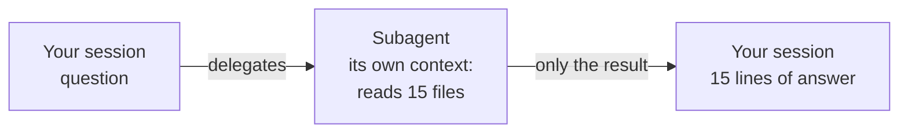

# Subagents

Delegate the work, get back only the conclusion

---

## Skill or subagent?

A **skill** is a set of instructions that enters **your** session.

A **subagent** is someone else: it has **its own context**, does the work on its own, and brings back only the conclusion.



Note: the difference matters when the work requires reading a lot. A skill doing the same thing would fill your session with the contents of those fifteen files, and after three rounds you'd run short of space.

---

## An agent is a file

```text
.claude/agents/auditor.md
```

```markdown [1-6|8-11]
--- 
name: auditor
description: Reviews the library and reports how it's doing. Triggers: how is the library doing, review the components, give me an audit.
model: sonnet
tools: Read, Glob, Grep
--- 

Read every component in src/components/, check the five files
and the conventions in CLAUDE.md. Report in fifteen lines max:
one per component, then the problems. Don't fix anything.
```

Same shape as a skill. Two new fields: **`model`** and **`tools`**.

---

## `tools`: this time it's a wall

- the auditor **has no `Write` or `Edit`**: it's not a recommendation, it simply **doesn't have them**
- an agent that should only look **must not be able to touch**
- if Claude also gave it `Write` or `Bash`, **remove them yourself**

| | What it limits | How strong |
|---|---|---|
| `allowed-tools` in a skill | what runs **without asking** | permission |
| `tools` in an agent | what **exists** for it | wall |

---

## When the tool is needed, but broad

A `stats` agent that counts lines and commits needs `Bash`. But with `Bash` it could also commit or delete.

```yaml
model: haiku
tools: Read, Glob, Grep, Bash
```

So the boundary goes **in the instructions**:

> Only use commands that read — `git log`, `git rev-list`, `wc`, `find`, `ls`.
> **Never** `git commit`, `git checkout`, `rm`.

- `model: haiku`: counting doesn't need a big model. **Faster, cheaper**

Note: these are the two ways to limit an agent: in the tools field, or in the instructions when the tool is needed and broad.

---

## An agent's numbers get verified

> what does the project look like in numbers?

You get a table back. Two numbers you check **by hand**:

```bash
git rev-list --count HEAD         # total commits
ls -d src/components/*/ | wc -l   # components
```

If they don't match, look at **what it ran** and tighten the instructions.

---

## An example from teamwork: `smoke-test`

```yaml
name: smoke-test
description: Checks that every page of the site responds.
tools: Bash
```

- a `curl` on every route, a **route → HTTP code** table
- ends with **ALL OK**, or the list of routes not answering 200
- **doesn't start the dev server**: if nothing answers, it just says so

**Noisy** work in a separate context, you get back only the verdict. One person writes it, **the whole team uses it**.

---

## The question to ask

<div class="box">

**Do I need to see the steps, or just the answer?**

</div>

| | |
|---|---|
| **Skill** | instructions in your context, you see everything that happens |
| **Subagent** | delegated work, separate context, only the result comes back |
