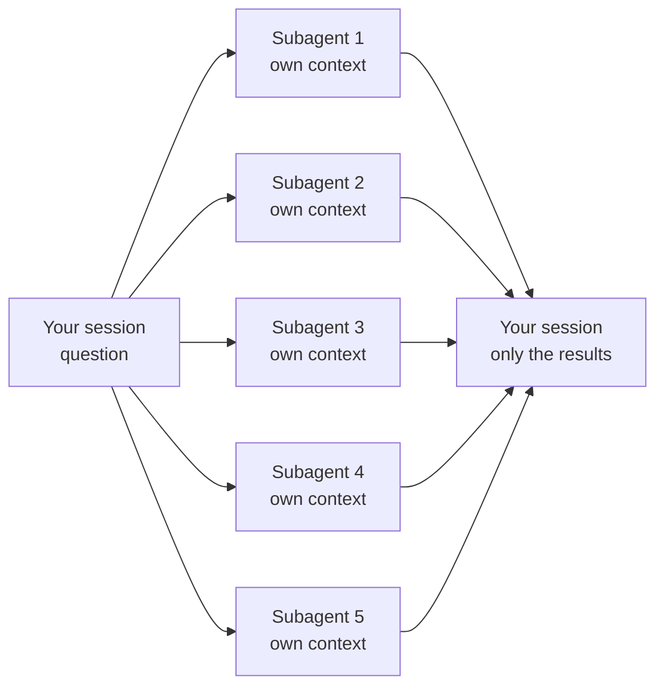

# Subagents

Delegate the work, get back only the conclusion

---

## Skill or subagent?

A **skill** is a set of instructions that enters **your** session.

A **subagent** is someone else: it has **its own context**, does the work on its own, and brings back only the conclusion.


```mermaid
flowchart LR
  Q["Your session<br/>question"] --> A1["Subagent 1<br/>own context"]
  Q --> A2["Subagent 2<br/>own context"]
  Q --> A3["Subagent 3<br/>own context"]
  Q --> A4["Subagent 4<br/>own context"]
  Q --> A5["Subagent 5<br/>own context"]
  A1 --> R["Your session<br/>only the results"]
  A2 --> R
  A3 --> R
  A4 --> R
  A5 --> R
```

Note: the difference matters when the work requires reading a lot. A skill doing the same thing would fill your session with the contents of those fifteen files, and after three rounds you'd run short of space.

---

## One Main Context Window


---

## Delegate to your _SubAgents_


---

## Built-in agents

Claude Code already ships with some agents: **you don't write them**.

| Agent | What it does | Tools |
|---|---|---|
| `Explore` | searches and reads the codebase, fast | **read-only** |
| `Plan` | gathers context before writing a plan (plan mode) | **read-only** |
| `general-purpose` | multi-step tasks: explores **and** changes | all |

Claude picks them **by itself** when a task fits. You see them in the terminal as `Agent(Explore)`.

Note: Explore and Plan skip CLAUDE.md and git status to stay cheap. Read-only means they can't cause side effects: that's why Claude uses them freely.

---

## Using the built-ins on purpose

```text
Use the Explore agent, very thorough: where do we build Tailwind
classes with template strings inside className?
```

- `Explore` has three levels: **quick**, **medium**, **very thorough**
- the search stays **in its context**: you get back only the answer
- when you write your own, mind the name: an agent of yours called `Explore` **replaces** the built-in one

<div class="box">

Before writing an agent that "searches the code", check if `Explore` already does it.

</div>

---

## Your own agent: just a file

```text
.claude/agents/auditor.md
```

```markdown [1-6|8-11]
--- 
name: auditor
description: Reviews the library and reports how it's doing. 
   Triggers: how is the library doing, review the components, give me an audit.
model: sonnet
tools: Read, Glob, Grep
--- 

Read every component in src/components/, check the five files and the conventions in CLAUDE.md. 
Report in fifteen lines max: one per component, then the problems. Don't fix anything.
```

Same shape as a skill. Two new fields: **`model`** and **`tools`**.

---

## `tools`: this time it's a wall

- the auditor **has no `Write` or `Edit`**: it's not a recommendation, it simply **doesn't have them**
- an agent that should only look **must not be able to touch**

| | What it limits | How strong |
|---|---|---|
| `allowed-tools` in a skill | what runs **without asking** | permission |
| `tools` in an agent | what **can do**  | wall |

---

## How to use it

| You write | What happens |
|---|---|
| `how is the library doing?` | Claude reads the **`description`** and picks the agent by itself |
| `use the auditor agent to review the components` | you **ask for it by name** |
| `@auditor review the components` | **@agent-name**: it runs for sure |

<p class="fragment">

- it works in **its own context**: you get back only the report


</p>

Note: from least to most explicit. Automatic delegation depends entirely on the description, which is why it lists the trigger phrases. When you want to be sure, type @ and pick the agent from the list.

---

## A second agent: `stats`

```text
.claude/agents/stats.md
```

```markdown 
--- 
name: stats
description: Measures the project and reports the numbers. Triggers: what does the project look like in numbers, 
  how many lines of code, project stats.
model: haiku
tools: Read, Glob, Grep, Bash
--- 

Measure the project and report one table: components, lines of .tsx
and .css in src/components/, total commits, commits that touch
src/components/, date of the last commit, skills and agents in .claude/.

Only use commands that read: git log, git rev-list, wc, find, ls.
Never git commit, git checkout, rm.
```

Same shape as the auditor. This time it needs **`Bash`**: counting commits takes `git`, counting lines takes `wc`.

---

## When the tool is needed, but broad

A `stats` agent that counts lines and commits needs `Bash`. But with `Bash` it could also commit or delete.

```yaml
model: haiku
tools: Read, Glob, Grep, Bash
```

So the boundary goes **in the instructions**:

> Only use commands that read — `git log`, `git rev-list`, `wc`, `find`, `ls`.

> **Never** `git commit`, `git checkout`, `rm`.

- `model: haiku`: counting doesn't need a big model. **Faster, cheaper**

Note: these are the two ways to limit an agent: in the tools field, or in the instructions when the tool is needed and broad.

---

## An agent's numbers get verified

> what does the project look like in numbers?

You get a table back. Two numbers you check **by hand**:

```bash
git rev-list --count HEAD         # total commits
ls -d src/components/*/ | wc -l   # components
```

If they don't match, look at **what it ran** and tighten the instructions.

> Always verify if your agents work before releasing them

---

## An example from teamwork: `smoke-test`

A **smoke test** is a fast first check that the app is alive. It only asks "does every page answer?", not "does every feature work?". If it fails, nothing else is worth testing yet.

```yaml
name: smoke-test
description: Checks that every page of the site responds.
tools: Bash
```

- a `curl` on every route, a **route → HTTP code** table
- ends with **ALL OK**, or the list of routes not answering 200
- **doesn't start the dev server**: if nothing answers, it just says so

**Noisy** work in a separate context, you get back only the verdict. One person writes it, **the whole team uses it**.

---

## The question to ask

<div class="box">

**Do I need to see the steps, or just the answer?**

</div>

| | |
|---|---|
| **Skill** | instructions in your context, you see everything that happens |
| **Subagent** | delegated work, separate context, only the result comes back |
