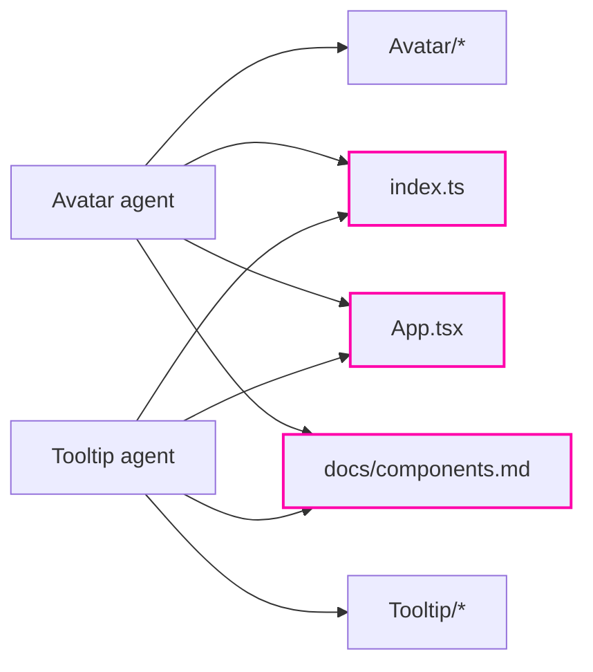

# Parallel agents

The time of the slowest, not the sum

---

## Launching them together

```text
Launch two agents in parallel: one adds the Avatar component to the library,
the other adds Tooltip. Each one touches all five files.
```

Two `Agent(…)` one below the other, working **at the same time**.

If two tasks don't depend on each other, the time is that of the **slowest**.

<div class="box">

But "don't depend on each other" is a phrase **to look at carefully**. That's the exercise.

</div>

---

## Independent in content, not in files



Two hands on the same file, at the same moment, **can't know about each other**.

---

## Four possible outcomes

- **All green.** The most likely: each agent re-read the shared files just before writing
- **One is missing from the showcase.** One agent overwrote the other → `/fix-conventions`
- **`npm run check` is red.** Same cause, louder: a duplicate export, a broken import
- **A rule not followed.** Not a collision: a rule with `paths` loads when Claude *opens* a file, and whoever **creates** a file from scratch may never open one

Note: step 8 of the workshop can go wrong and that's expected. The point isn't which outcome you get, it's understanding why.

---

## Check with the tools you have

Not by eye.

```bash
npm run check
```

```text
/check-conventions
```

```text
Avatar   ✅
Badge    ✅
Callout  ✅
Tooltip  ⚠️  the outermost element is a <span>, doesn't follow ui.md
```

The skills you wrote earlier become the **safety net** for parallel work.

---

## Parallelising well

- split by **file**, not just by topic
- shared files (registries, indexes, routes) are the **collision** point
- in a team the same idea is called **ownership areas**: everyone has their own files, the contract is frozen
- once done: **automatic check**, then commit

<div class="box">

Three people or three agents, the problem is the same: **who writes where**.

</div>

Note: in the team workshop the three tracks are designed not to depend on each other, and the contract (types, routes, component signatures) is only discussed at the start. After that it's frozen. It's the same principle that makes parallel agents safe.
