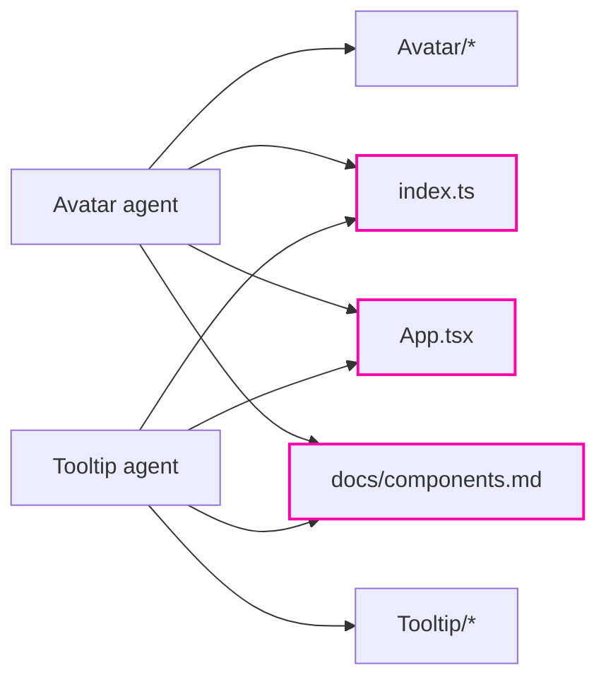
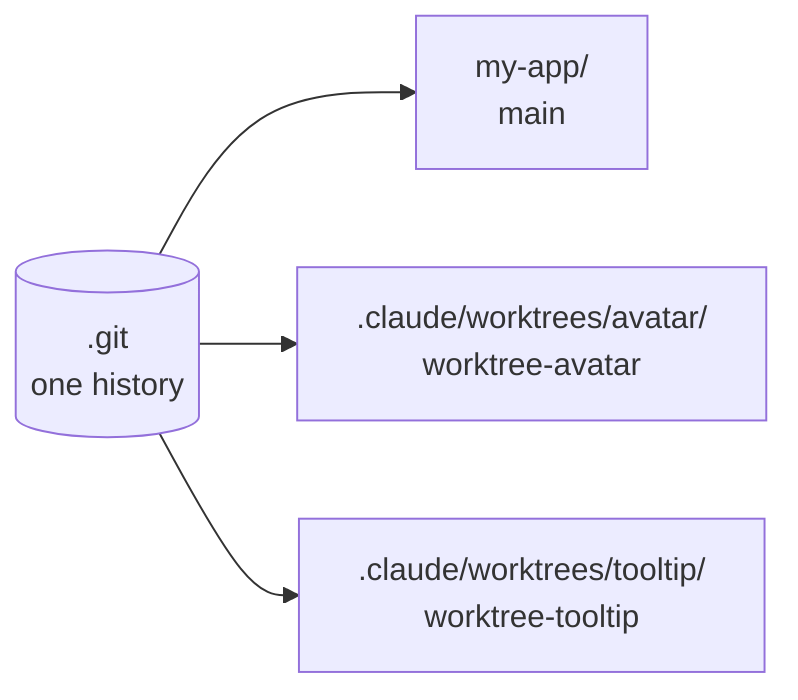
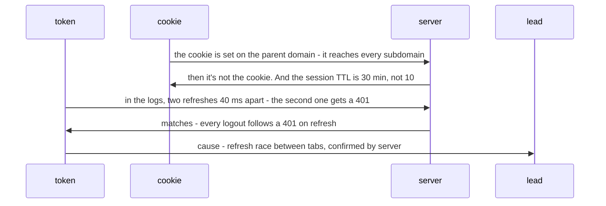

# Parallel agents

The time of the slowest, not the sum

---

## Launching them together

```text
Launch two agents in parallel: one adds the Avatar component to the library,
the other adds Tooltip. Each one touches all five files.
```

Two `Agent(…)` one below the other, working **at the same time**.

If two tasks don't depend on each other, the time is that of the **slowest**.

<div class="box">

But "don't depend on each other" is a phrase **to look at carefully**. 

</div>

---

## Independent in content, not in files


```mermaid
flowchart LR
  A1[Avatar agent] --> AV[Avatar/*]
  A2[Tooltip agent] --> TT[Tooltip/*]
  A1 --> IDX[index.ts]
  A2 --> IDX
  A1 --> APP[App.tsx]
  A2 --> APP
  A1 --> DOC[docs/components.md]
  A2 --> DOC
  style IDX stroke:#f0a,stroke-width:2px
  style APP stroke:#f0a,stroke-width:2px
  style DOC stroke:#f0a,stroke-width:2px
```

Two hands on the same file, at the same moment, **can't know about each other**.

---

## When the two agents finish

Most of the time: **all green**.

<div class="box">

`Edit` refuses to write if the file changed since the agent read it: the agent **re-reads it and retries**, and sees the other one's change.

</div>

The risk is in the gaps that check doesn't cover: a file changed through `Bash` (`sed`, `cat >`), or two edits in the **same instant**.

Note: step 8 of the workshop can go wrong and that's expected. The point isn't which outcome you get, it's understanding why.

---

## Two hands, one file: what can go wrong

| | What happens | You notice it… |
|---|---|---|
| **Lost write** | B saves over A: `Avatar` disappears from `index.ts` | **hardly**: everything still compiles |
| **Broken file** | both edits land but clash: duplicate export | `npm run check` turns **red** |
| **Logical clash** | each edit is fine, together they contradict: same route | only at **runtime** or in review |

Ways out, coming up next: **verify** · **one owner per shared file** · **worktrees**

Note: the lost write is the dangerous one: everything compiles, a line is just gone, and Avatar is missing from the showcase (App.tsx) too; /fix-conventions puts it back. A broken file can also be an import of a file that isn't there yet; a logical clash can be the same id as well as the same route. Ways out: verify with the tools you already have; give each shared file one owner, or update it at the end; worktrees give every agent its own copy, so the conflict moves to merge time, where git shows it to you.

---

## Check with the tools you have

- **broken file** → `npm run check`
- **lost write** → `/check-conventions`: it checks the five files
- **logical clash** → no tool: **you**, in review

```text
/check-conventions

Avatar   ⚠️  missing from index.ts and App.tsx
Badge    ✅
Callout  ✅
Tooltip  ✅
```

→ `/fix-conventions Avatar`

The skills you wrote earlier become the **safety net** for parallel work.

Note: /check-conventions can also flag something that isn't a collision: a rule with paths loads when Claude opens a matching file, and an agent that creates one from scratch may never open one (e.g. Tooltip with a span as outermost element, which doesn't follow ui.md).

---

## Parallelising well: split by file

Avatar and Tooltip are two topics, but **not** two sets of files:

- **own files** (`Avatar/*`, `Tooltip/*`): only one agent touches them, no risk
- **shared files** (`index.ts`, `App.tsx`, `docs/components.md`): they list *every* component, so every agent wants to add its line. That's where they **collide**

The rule: each agent writes **only its own files**. Shared files get **one owner**, or are updated **once, at the end**.

```text
Launch two agents in parallel: one creates the Avatar files, the other Tooltip.
Don't touch index.ts, App.tsx or docs: register both at the end.
```

Then: **automatic check**, and only after that, commit.

---

## Same problem in a team

In a team the same idea is called **ownership areas**:

- everyone has **their own files**
- what everyone uses (types, routes, component signatures) is the **contract**: agreed at the start, then **frozen**
- nobody changes the contract on the way, so nobody breaks someone else's work

In the team workshop the three tracks are designed this way: they don't depend on each other.

<div class="box">

Three people or three agents, the problem is the same: **who writes where**.

</div>

---

## Main Context + 3 agents


- teammates appear **below the prompt**: `↑` `↓` to pick one, `Enter` to open it and talk to it directly
- `Ctrl+T` shows the task list

---

## What a worktree is


```mermaid
flowchart LR
  G[(".git<br/>one history")] --> M["my-app/<br/>main"]
  G --> A[".claude/worktrees/avatar/<br/>worktree-avatar"]
  G --> T[".claude/worktrees/tooltip/<br/>worktree-tooltip"]
```

- plain git (`git worktree`): **more folders, one repo**, each folder on its own branch
- it's **not a clone**: history is shared, so it's fast and light
- `claude -w avatar` creates the folder and the branch `worktree-avatar`, then starts Claude **inside it**
- on exit: an untouched worktree is removed, one with changes **asks** whether to keep it

Note: the branch starts from the repository's default branch. Subagents can get one too, with `isolation: worktree` in the frontmatter: a temporary worktree, removed if the agent changed nothing.

---

## Parallel sessions

Not agents launched by Claude: **more `claude` sessions**, launched by you.

```bash
claude -w avatar     # session 1 → .claude/worktrees/avatar/
claude -w tooltip    # session 2 → .claude/worktrees/tooltip/
```

- `-w` (`--worktree`) gives every session **its own copy of the repo**, on its own branch: no collisions on files
- you coordinate them, and you merge the branches at the end
- `claude agents` shows all the background sessions in one view (**research preview**)

<div class="box">

Subagents share your files. Worktrees **don't**: the most robust way to work in parallel.

</div>

---

## Worktrees: pros and cons

<div class="cols">
<div class="col">

**Pros**

- **no collisions** while working: every session writes in its own folder
- one branch per task: **review, merge or throw away** each one on its own
- cheap: shared history, no clone
- works for subagents too: `isolation: worktree`

</div>
<div class="col">

**Cons**

- ignored files aren't there: **`node_modules`, `.env`** → `npm install` in every worktree
- two dev servers on the same **port** clash
- **you** merge the branches at the end
- more folders and branches to keep track of

</div>
</div>

<div class="box">

Worktrees separate the **files**, not the **contract**: two branches that both touch `index.ts` still conflict, at merge time.

</div>

---

## Merge time: where conflicts show up

```bash
git merge worktree-avatar     # ✅ clean
git merge worktree-tooltip    # ❌ CONFLICT in src/components/index.ts
```

```text
<<<<<<< HEAD
export { Avatar } from './Avatar';
=======
export { Tooltip } from './Tooltip';
>>>>>>> worktree-tooltip
```

- git **stops** and writes both versions in the file: nothing is lost, nothing is chosen for you
- in registries and indexes the answer is almost always **keep both**
- let Claude do it: `merge worktree-tooltip, resolve the conflicts keeping both components`
- then `npm run check` + `/check-conventions`, and only then commit

<div class="box">

**One branch at a time**: merge, check, then the next. Even better: rebase the second branch on `main` **inside its worktree**, so the session that wrote the code resolves its own conflict.

</div>

Note: to avoid most conflicts, prepare the shared files on main before launching the sessions (empty entries in index.ts, routes in App.tsx). It's the "frozen contract" from the parallelising slide.

---

# Agent teams: the _swarm_

---


- every teammate is a **separate Claude Code instance**, with its own context
- they **talk to each other**, not only to the lead
- they **claim tasks** from a shared list, with dependencies

---

## Parallel subagents vs agent team

**Parallel subagents** are workers: each gets its task, reports back to you, and they never meet.

An **agent team** is a meeting: a lead and some teammates share a task list and **talk to each other** while they work.

| | Parallel subagents | Agent team |
|---|---|---|
| Who they talk to | only the main agent | **each other**, and the lead |
| Who splits the work | you, **before** launching them | a shared task list: they **claim** tasks |
| Each one is | a helper inside your session | a **full Claude Code session** |
| Cost | lower | **higher** |
| Status | stable | **experimental** |

<div class="box">

Separate tasks → **subagents**. Findings to discuss and challenge → **a team**.

</div>

---

## Who splits the work

<div class="cols">
<div class="col">

**Parallel subagents**: you, **before** launching them

```text
Agent 1 → Avatar
Agent 2 → Tooltip
```

Each one gets its task and keeps it until the end.

</div>
<div class="col">

**Agent team**: the lead writes a **task list**

```text
1. Color tokens       ✔ done     tokens
2. Update components  ● claimed  components
3. Showcase + docs    ● claimed  docs
4. Contrast review    ⏸ waits for 2, 3
```

A free teammate **claims** the next free task: it's theirs, nobody else takes it.

</div>
</div>

- a task can **wait** for others: it starts only when they're done
- the work gets split **while** it runs, not all at the start
- `Ctrl+T` shows the list

---

## A full Claude Code session

<div class="cols">
<div class="col">

**Subagent**: a helper **inside** your session

- gets a prompt, works, returns a **summary**
- then it's **gone**
- you can't talk to it

</div>
<div class="col">

**Teammate**: **another `claude`** running

- its own context: loads CLAUDE.md, skills, MCP
- starts **blank**: it knows only what the lead tells it when creating it
- talks to the others through **messages**, not shared memory
- **stays open** after its task: select it (`↑` `↓`, `Enter`) and write to it directly, like any session
- costs like a **whole session**

</div>
</div>

<div class="box">

A subagent is a **function call**. A teammate is a **colleague**.

</div>

---

## Starting an _Agent Team_

**Experimental**: off by default.

```json
// .claude/settings.json
{ "env": { "CLAUDE_CODE_EXPERIMENTAL_AGENT_TEAMS": "1" } }
```

Note: teammates load CLAUDE.md, skills and MCP, but not the lead's conversation: put the context they need in the spawn prompt. With tmux or iTerm2 each teammate can get its own pane.

---

## A team that debates

Same symptom, **three competing causes**: if one is right, the others are wrong.

```text [1-5|6-8]
Users get logged out at random, usually after about 10 minutes.
Create an agent team of three, one hypothesis each:
- token: two tabs refresh the token at the same time, one invalidates the other
- cookie: the session cookie is lost between subdomains
- server: the session expires early behind the load balancer
Each one proves its own hypothesis and sends the others
any evidence that rules theirs out.
Report the cause that survives, with the evidence.
```

**Sharing evidence** is what makes it a team. Without it, three subagents are enough.

---

## What happens inside


```mermaid
sequenceDiagram
  participant T as token
  participant C as cookie
  participant S as server
  participant L as lead
  C->>S: the cookie is set on the parent domain - it reaches every subdomain
  S->>C: then it's not the cookie. And the session TTL is 30 min, not 10
  T->>S: in the logs, two refreshes 40 ms apart - the second one gets a 401
  S->>T: matches - every logout follows a 401 on refresh
  T->>L: cause - refresh race between tabs, confirmed by server
```

- they **message each other by name**, without going through the lead
- every hypothesis gets **attacked**, not just proposed
- the lead gets **one cause with evidence**, not three guesses

Note: an illustrative exchange, not a real transcript. With parallel subagents none of these arrows between teammates could exist: each one only reports to the main agent.

---

## Another team: building together

```text
Create an agent team to add dark mode to the library.
- tokens: defines the color variables for light and dark
- components: updates every component to use them
- docs: adds dark mode to the showcase and docs/components.md
- reviewer: checks contrast and conventions, sends issues back to whoever owns the file
Each teammate only writes its own files.
```

- **dependencies**: `components` waits until `tokens` is done
- **useful messages**: "what's the dark background variable called?"
- **ownership**: one owner per file, the reviewer sends issues back to it

<div class="box">

Debating or building: a team pays off when agents **need each other while they work**.

</div>
