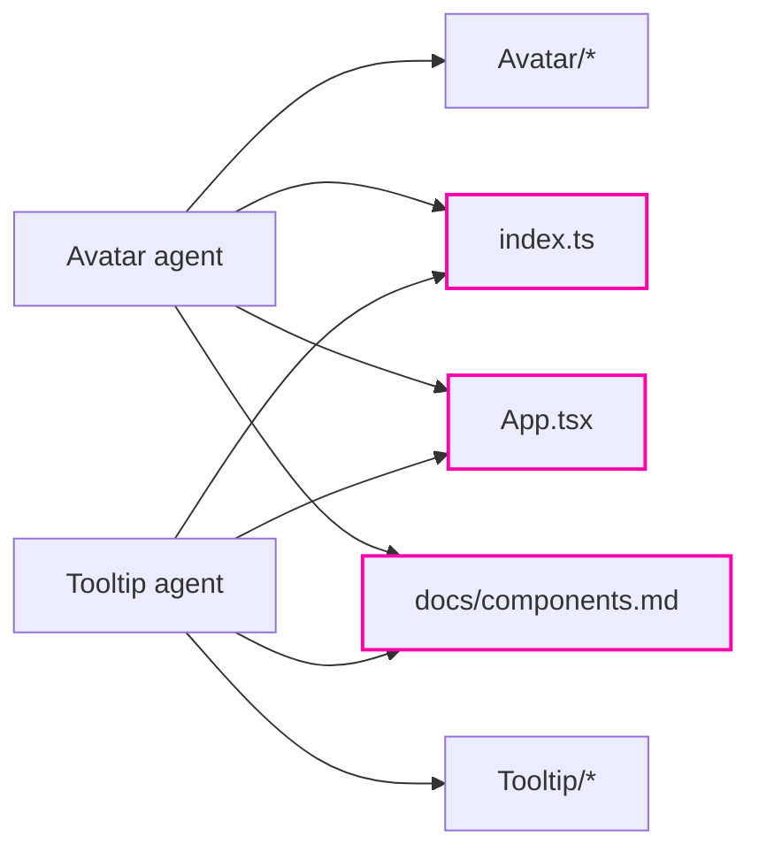
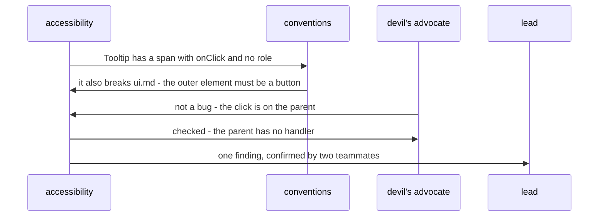
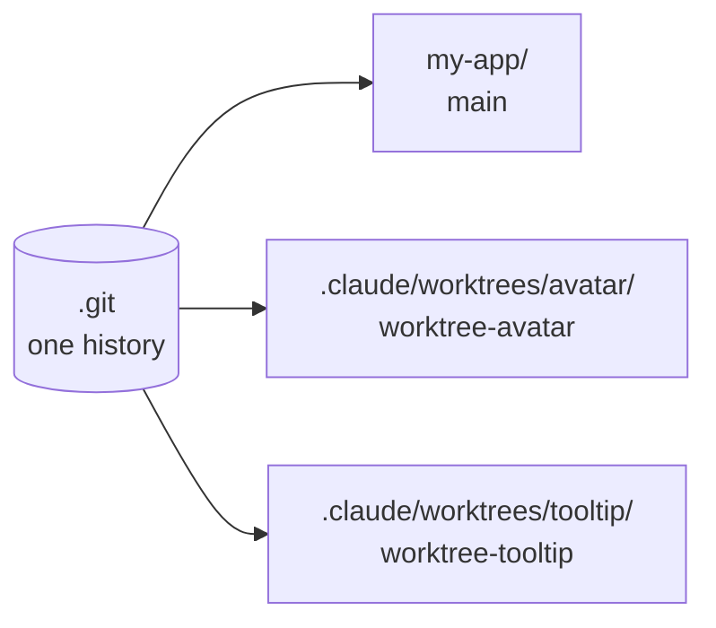

# Parallel agents

The time of the slowest, not the sum

---

## Launching them together

```text
Launch two agents in parallel: one adds the Avatar component to the library,
the other adds Tooltip. Each one touches all five files.
```

Two `Agent(…)` one below the other, working **at the same time**.

If two tasks don't depend on each other, the time is that of the **slowest**.

<div class="box">

But "don't depend on each other" is a phrase **to look at carefully**. That's the exercise.

</div>

---

## Independent in content, not in files


```mermaid
flowchart LR
  A1[Avatar agent] --> AV[Avatar/*]
  A2[Tooltip agent] --> TT[Tooltip/*]
  A1 --> IDX[index.ts]
  A2 --> IDX
  A1 --> APP[App.tsx]
  A2 --> APP
  A1 --> DOC[docs/components.md]
  A2 --> DOC
  style IDX stroke:#f0a,stroke-width:2px
  style APP stroke:#f0a,stroke-width:2px
  style DOC stroke:#f0a,stroke-width:2px
```

Two hands on the same file, at the same moment, **can't know about each other**.

---

## Four possible outcomes

- **All green.** The most likely: each agent re-read the shared files just before writing
- **One is missing from the showcase.** One agent overwrote the other → `/fix-conventions`
- **`npm run check` is red.** Same cause, louder: a duplicate export, a broken import
- **A rule not followed.** Not a collision: a rule with `paths` loads when Claude *opens* a file, and whoever **creates** a file from scratch may never open one

Note: step 8 of the workshop can go wrong and that's expected. The point isn't which outcome you get, it's understanding why.

---

## Check with the tools you have

Not by eye.

```bash
npm run check
```

```text
/check-conventions
```

```text
Avatar   ✅
Badge    ✅
Callout  ✅
Tooltip  ⚠️  the outermost element is a <span>, doesn't follow ui.md
```

The skills you wrote earlier become the **safety net** for parallel work.

---

## Parallelising well

- split by **file**, not just by topic
- shared files (registries, indexes, routes) are the **collision** point
- in a team the same idea is called **ownership areas**: everyone has their own files, the contract is frozen
- once done: **automatic check**, then commit

<div class="box">

Three people or three agents, the problem is the same: **who writes where**.

</div>

Note: in the team workshop the three tracks are designed not to depend on each other, and the contract (types, routes, component signatures) is only discussed at the start. After that it's frozen. It's the same principle that makes parallel agents safe.

---

## Built-in agents

Claude Code already ships with some agents: **you don't write them**.

| Agent | What it does | Tools |
|---|---|---|
| `Explore` | searches and reads the codebase, fast | **read-only** |
| `Plan` | gathers context before writing a plan (plan mode) | **read-only** |
| `general-purpose` | multi-step tasks: explores **and** changes | all |

Claude picks them **by itself** when a task fits. You see them in the terminal as `Agent(Explore)`.

Note: Explore and Plan skip CLAUDE.md and git status to stay cheap. Read-only means they can't cause side effects: that's why Claude uses them freely.

---

## Using the built-ins on purpose

```text
Use the Explore agent, very thorough: where do we build Tailwind
classes with template strings inside className?
```

- `Explore` has three levels: **quick**, **medium**, **very thorough**
- the search stays **in its context**: you get back only the answer
- same name, your file: an agent called `Explore` in `.claude/agents/` **replaces** the built-in one

<div class="box">

Before writing an agent that "searches the code", check if `Explore` already does it.

</div>

---

# Agent teams: the _swarm_

---


- every teammate is a **separate Claude Code instance**, with its own context
- they **talk to each other**, not only to the lead
- they **claim tasks** from a shared list, with dependencies

---

## Starting an _Agent Team_

**Experimental**: off by default.

```json
// .claude/settings.json
{ "env": { "CLAUDE_CODE_EXPERIMENTAL_AGENT_TEAMS": "1" } }
```

### Prompt:

```text [1-4|6]
Spawn an agent team of three teammates to review the library:
- one checks accessibility, 
- one the conventions in CLAUDE.md
- one plays devil's advocate. 

Have them challenge each other's findings.
```

Without the last line, **three subagents are enough**.

Note: teammates load CLAUDE.md, skills and MCP, but not the lead's conversation: put the context they need in the spawn prompt. With tmux or iTerm2 each teammate can get its own pane.

---

## What happens inside


```mermaid
sequenceDiagram
  participant A as accessibility
  participant C as conventions
  participant D as devil's advocate
  participant L as lead
  A->>C: Tooltip has a span with onClick and no role
  C->>A: it also breaks ui.md - the outer element must be a button
  D->>A: not a bug - the click is on the parent
  A->>D: checked - the parent has no handler
  A->>L: one finding, confirmed by two teammates
```

- they **message each other by name**, without going through the lead
- a finding that survives a challenge **is worth more**
- the lead gets **one discussed conclusion**, not three lists to compare

Note: an illustrative exchange, not a real transcript. With parallel subagents none of these arrows between teammates could exist: each one only reports to the main agent.

---

## Main Context + 3 agents


- teammates appear **below the prompt**: `↑` `↓` to pick one, `Enter` to open it and talk to it directly
- `Ctrl+T` shows the task list

---

<!-- disabled -->

/
## Subagents or a team?

| | Parallel subagents | Agent team |
|---|---|---|
| Talk to each other | no, they report to the main agent | **yes**, directly |
| Who coordinates | you, **before** launching them | the lead and the teammates, **while** working |
| Cost | lower | **higher**: every teammate is a full session |
| Status | stable | experimental |

- a team is worth it when agents must **share findings and challenge each other**: research, review
- **3–5 teammates**, and the file problem stays: two teammates on the same file overwrite each other

---

## Parallel sessions

Not agents launched by Claude: **more `claude` sessions**, launched by you.

```bash
claude -w avatar     # session 1 → .claude/worktrees/avatar/
claude -w tooltip    # session 2 → .claude/worktrees/tooltip/
```

- `-w` (`--worktree`) gives every session **its own copy of the repo**, on its own branch: no collisions on files
- you coordinate them, and you merge the branches at the end
- `claude agents` shows all the background sessions in one view (**research preview**)

<div class="box">

Subagents share your files. Worktrees **don't**: the most robust way to work in parallel.

</div>

---

## What a worktree is


```mermaid
flowchart LR
  G[(".git<br/>one history")] --> M["my-app/<br/>main"]
  G --> A[".claude/worktrees/avatar/<br/>worktree-avatar"]
  G --> T[".claude/worktrees/tooltip/<br/>worktree-tooltip"]
```

- plain git (`git worktree`): **more folders, one repo**, each folder on its own branch
- it's **not a clone**: history is shared, so it's fast and light
- `claude -w avatar` creates the folder and the branch `worktree-avatar`, then starts Claude **inside it**
- on exit: an untouched worktree is removed, one with changes **asks** whether to keep it

Note: the branch starts from the repository's default branch. Subagents can get one too, with `isolation: worktree` in the frontmatter: a temporary worktree, removed if the agent changed nothing.

---

## Worktrees: pros and cons

<div class="cols">
<div class="col">

**Pros**

- **no collisions** while working: every session writes in its own folder
- one branch per task: **review, merge or throw away** each one on its own
- cheap: shared history, no clone
- works for subagents too: `isolation: worktree`

</div>
<div class="col">

**Cons**

- ignored files aren't there: **`node_modules`, `.env`** → `npm install` in every worktree
- two dev servers on the same **port** clash
- **you** merge the branches at the end
- more folders and branches to keep track of

</div>
</div>

<div class="box">

Worktrees separate the **files**, not the **contract**: two branches that both touch `index.ts` still conflict, at merge time.

</div>
