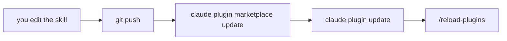

# Plugins

The box that carries skills and agents everywhere

---

## Where a skill lives, and who sees it

| Where it lives | Who sees it |
|---|---|
| `~/.claude/skills/` | only you, in all your projects |
| `.claude/skills/` in the repo | whoever clones the repo |
| in a **plugin** | anyone who installs it, in any project |

- a **plugin** is a folder with skills, agents (and hooks) inside
- a **marketplace** is the list you install from: a local folder or a GitHub repo

---

## Installing a plugin from GitHub

```bash
claude plugin marketplace add trainingfb/claude-fb-marketplace-demo-workshop --scope project
claude plugin install git@claude-fb-marketplace-demo-workshop --scope project
claude plugin list | grep -A3 "git@"
```

- **`plugin@marketplace`**: these are the `name`s written in the JSON files, not folder names
- **`--scope project`**: goes into `.claude/settings.json`, gets committed, **whoever clones gets it**
- without `--scope` the default is `user`: it applies to you, and reaches nobody else

Note: the workshop plugin is called git, and it has two skills that work in any repo: commit (check, message from the diff, commit) and pr (commit, push, draft pull request).

---

## Using it

A plugin's skills are called like yours: with a normal sentence, or with the **plugin prefix**.

```text
/git:commit
/git:pr
```

`/git:commit` runs `npm run check`, reads the diff, writes the message. **If the check fails it stops**, and tells you why.

- after installing or updating: **`/reload-plugins`** or restart

---

## Building one

```text
johndoe-plugins/
├── .claude-plugin/
│   ├── plugin.json         ← what the plugin is called
│   └── marketplace.json    ← the list you install from
└── skills/
    └── folder-info/
        └── SKILL.md
```

<div class="cols">
<div class="col">

```json
{
  "name": "dev-tools",
  "version": "1.0.0",
  "author": { "name": "John Doe" }
}
```

</div>
<div class="col">

```json
{
  "name": "johndoe-plugins",
  "owner": { "name": "John Doe" },
  "plugins": [
    { "name": "dev-tools", "source": "./" }
  ]
}
```

</div>
</div>

Note: the plugin folder doesn't go inside the project: it's not that project's code, it's your own stuff that applies everywhere.

---

## What goes in a plugin

<div class="box">

A plugin holds **what applies everywhere**. The rest is fine where it is, in `.claude/skills/`.

</div>

- `new-component`, `check-conventions` talk about `src/components/` and the five files: **they stay in the project**
- `folder-info` measures any folder, names no project file: **it goes in the plugin**
- `commit`, `pr`, `ship`: the git flow is the same in every repo: **plugin**

---

## Validate, install, try

```bash
claude plugin validate ./johndoe-plugins --strict     # Validation passed

claude plugin marketplace add ./johndoe-plugins
claude plugin install dev-tools@johndoe-plugins
```

```text
/dev-tools:folder-info src
```

- `--strict` is stricter than needed: it's what you want **before giving it to others**
- the marketplace `name` **can't start with `claude`**
- a modified skill **isn't seen** by the open session: `/reload-plugins`

---

## The update cycle



A push **reaches nobody** until they pull it down. Plugin users update when they want.

Note: publishing to GitHub is optional in the workshop. You need a repo with .claude-plugin/marketplace.json at the root. The honest test is installing it from the remote, not from the local folder.
