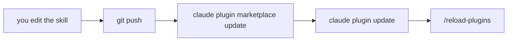

# Plugins

The box that carries skills and agents everywhere

---

## Plugin and marketplace

<div class="cols">
<div class="col">

**Plugin**: a package

- a folder with skills, agents, hooks, MCP servers
- it has a name and a version: `git` 1.0.0
- installed, updated and removed **as one block**

</div>
<div class="col">

**Marketplace**: the shelf

- the list of plugins you can install
- a local folder or a **GitHub repo**
- you add it once, then install only what you need

</div>
</div>

<div class="box">

**Why**: copying skills from repo to repo doesn't scale. A plugin is written once, versioned, and reaches **every project and every colleague** with one command.

</div>

Note: same idea as an npm package and the npm registry. The marketplace is where you look, the plugin is what you install.

---

## Where a skill lives, and who sees it

| Where it lives | Who sees it |
|---|---|
| `~/.claude/skills/` | only you, in all your projects |
| `.claude/skills/` in the repo | whoever clones the repo |
| in a **plugin** | anyone who installs it, in any project |

---

## Installing a plugin from GitHub

```bash
claude plugin marketplace add trainingfb/claude-fb-marketplace-demo-workshop --scope project
claude plugin install git@claude-fb-marketplace-demo-workshop --scope project
claude plugin list | grep -A3 "git@"
```

- **`plugin@marketplace`**: these are the `name`s written in the JSON files, not folder names
- **`--scope project`**: goes into `.claude/settings.json`, gets committed, **whoever clones gets it**
- without `--scope` the default is `user`: it applies to you, and reaches nobody else


> after installing or updating: **`/reload-plugins`** or restart

<!-- .element: class="fragment" -->

Note: the workshop plugin is called git, and it has two skills that work in any repo: commit (check, message from the diff, commit) and pr (commit, push, draft pull request).

---

## Using it

A plugin's skills are called like yours: with a normal sentence, or with the **plugin prefix**.

```text
/git:commit
/git:pr
```

`/git:commit` runs `npm run check`, reads the diff, writes the message. **If the check fails it stops**, and tells you why.

---

## Building one

```text
johndoe-plugins/
├── .claude-plugin/
│   ├── plugin.json         ← what the plugin is called
│   └── marketplace.json    ← the list you install from
└── skills/
    └── folder-info/
        └── SKILL.md
```

<div class="cols">
<div class="col">

**`plugin.json`**: what the plugin is

```json
{
  "name": "dev-tools",
  "version": "1.0.0",
  "author": { "name": "John Doe" }
}
```

</div>
<div class="col">

**`marketplace.json`**: where you install it from

```json
{
  "name": "johndoe-plugins",
  "owner": { "name": "John Doe" },
  "plugins": [
    { "name": "dev-tools", "source": "./" }
  ]
}
```

</div>
</div>

Note: the plugin folder doesn't go inside the project: it's not that project's code, it's your own stuff that applies everywhere.

---

## One marketplace, many plugins

<div class="cols">
<div class="col">

```text
johndoe-plugins/
├── .claude-plugin/
│   └── marketplace.json
└── plugins/
    ├── git/
    │   ├── .claude-plugin/plugin.json
    │   └── skills/
    │       ├── commit/SKILL.md
    │       └── pr/SKILL.md
    └── dev-tools/
        ├── .claude-plugin/plugin.json
        └── skills/
            └── folder-info/SKILL.md
```

</div>
<div class="col">

**`marketplace.json`**: one entry per plugin

```json
{
  "name": "johndoe-plugins",
  "owner": { "name": "John Doe" },
  "plugins": [
    { "name": "git",
      "source": "./plugins/git" },
    { "name": "dev-tools",
      "source": "./plugins/dev-tools" }
  ]
}
```

</div>
</div>

- every plugin has **its own folder** and its own `plugin.json`
- each one is **installed separately**: `git@johndoe-plugins`, `dev-tools@johndoe-plugins`
- group skills **by topic**: whoever needs only git doesn't get the rest

Note: the workshop marketplace (workshop1-marketplace) has exactly this shape, with plugins/git. With a single plugin, source "./" is enough, as in the previous slide; with more than one, each source points to its subfolder.

---

## Inside `git`: the `commit` skill

```markdown
--- 
name: commit
description: Runs the project's check, lint or test and stops if they fail,
  then writes the commit message from the diff and commits.
allowed-tools: Read, Grep, Bash(git:*), Bash(npm run:*)
--- 
1. run the first script found among check, lint, test → **if it fails, stop**
2. `git status --short` + `git diff`: what changed
3. one line, conventional commit: `feat: add Divider component to the library`
```

- it **knows nothing about the project**, it discovers it: that's why it fits a plugin
- `allowed-tools` lets it run only `git` and `npm run`

Note: abridged from the real workshop plugin, workshop1-marketplace/plugins/git. The full SKILL.md also says what not to do: no git add -A without looking at status, no commit if step 1 fails, and propose two commits when the diff mixes two unrelated changes.

---

## What goes in a plugin

<div class="box">

A plugin holds **what applies everywhere**. The rest is fine where it is, in `.claude/skills/`.

</div>

- `new-component`, `check-conventions` talk about `src/components/` and the five files: **they stay in the project**
- `folder-info` measures any folder, names no project file: **it goes in the plugin**
- `commit`, `pr`, `ship`: the git flow is the same in every repo: **plugin**

---

## Validate, install, try

```bash
claude plugin validate ./johndoe-plugins --strict     # Validation passed

claude plugin marketplace add ./johndoe-plugins
claude plugin install dev-tools@johndoe-plugins
```

```text
/dev-tools:folder-info src
```

- `--strict` is stricter than needed: it's what you want **before giving it to others**
- the marketplace `name` **can't start with `claude`**
- a modified skill **isn't seen** by the open session: `/reload-plugins`

---

## The update cycle


```mermaid
flowchart LR
  E[you edit the skill] --> P[git push]
  P --> M["claude plugin marketplace update"]
  M --> U["claude plugin update"]
  U --> R["/reload-plugins"]
```

A push **reaches nobody** until they pull it down. Plugin users update when they want.

Note: publishing to GitHub is optional in the workshop. You need a repo with .claude-plugin/marketplace.json at the root. The honest test is installing it from the remote, not from the local folder.
