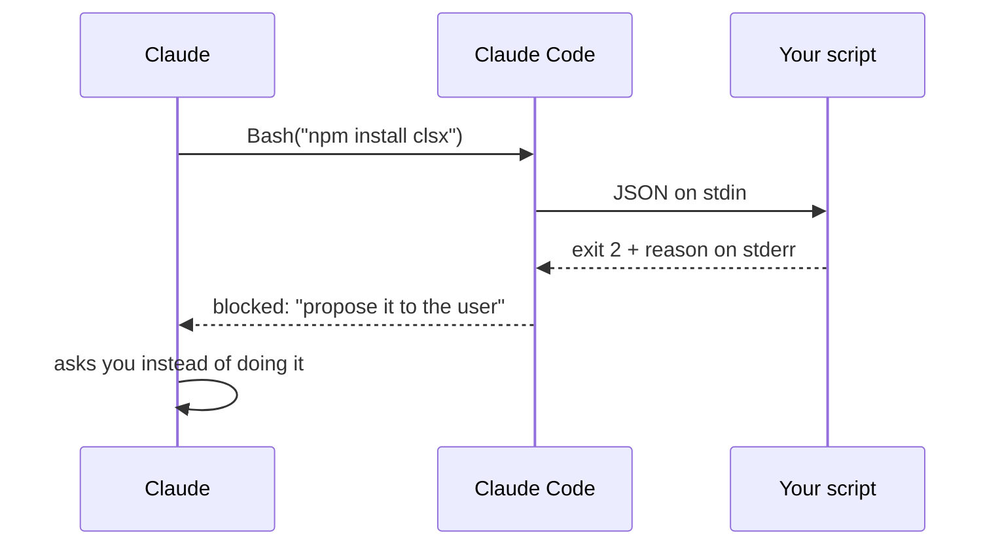

# Hooks

What must never happen

---

## A rule asks, a hook enforces

<div class="cols">
<div class="col">

**Rule**

"Don't add dependencies without asking."

Claude reads it and **decides** to follow it. It almost always does, but it remains **its own decision**.

</div>
<div class="col">

**Hook**

A **command of yours** that Claude Code runs before or after an action, and that can stop it.

**It doesn't go through the model**: it always happens.

</div>
</div>

---

## How it works



- **exit 0** → let it through
- **exit 2** → block, and whatever you write to **stderr** reaches Claude as the reason

---

## The script

```js [1-5|7-12|14|16-21]
import { readFileSync } from "node:fs";

// Claude Code passes the event data as JSON on stdin.
const { tool_input } = JSON.parse(readFileSync(0, "utf8"));
const command = tool_input?.command ?? "";

// `npm install|i|add` followed by at least one package.
// A bare `npm install`, which reinstalls what's there, passes.
const match = command.match(/\bnpm\s+(?:install|i|add)\b(.*)/);
const packages = match
  ? match[1].trim().split(/\s+/).filter((p) => p && !p.startsWith("-"))
  : [];

if (packages.length === 0) process.exit(0);

console.error(
  `Blocked: \`${command}\` adds ${packages.join(", ")} to the project. ` +
    "Dependencies aren't added here without asking: propose it to the user.",
);
process.exit(2);
```

`.claude/hooks/no-dependencies.mjs`

---

## Test it without Claude

```bash
echo '{"tool_input":{"command":"npm install clsx"}}' \
  | node .claude/hooks/no-dependencies.mjs; echo $?     # message, then 2

echo '{"tool_input":{"command":"npm run check"}}' \
  | node .claude/hooks/no-dependencies.mjs; echo $?     # nothing, then 0
```

<div class="box">

A broken hook **blocks everything or blocks nothing**, and doesn't tell you. Test it by hand first.

</div>

Note: the second case is by far the most frequent. The hook runs on EVERY Bash command and almost always has to let it through silently. On PowerShell the exit code comes from echo $LASTEXITCODE.

---

## Register it in `.claude/settings.json`

```json [2|3|5|6-9]
{
  "hooks": {
    "PreToolUse": [
      {
        "matcher": "Bash",
        "hooks": [
          { "type": "command",
            "command": "node \"$CLAUDE_PROJECT_DIR\"/.claude/hooks/no-dependencies.mjs" }
        ]
      }
    ]
  }
}
```

- **event**: `PreToolUse`, `PostToolUse`, `Stop`, `SessionStart`…
- **`matcher`**: the tool. `Bash`, or `Edit|Write`. Case-sensitive
- **`$CLAUDE_PROJECT_DIR`**: the root, even if Claude is in a subfolder
- `/hooks` in the session to check it was loaded

---

## The result

> install clsx and use it in Button to compose the classes

Claude tries `npm install clsx`, the command **doesn't run**, it gets your message, and asks you whether to add it.

<div class="box">

It didn't obey: **it couldn't**.

</div>

- it holds even with permissions disabled, and for subagents
- `settings.json` gets committed: it applies to the team. For a hook of your own: `settings.local.json`

---

## The other use: acting, silently

A `PostToolUse` hook on `Edit|Write` that runs the **linter on the file just touched**:

- clean → nothing
- error → reaches Claude **right away**, which fixes it on the spot instead of at the end

```js
appendFileSync(".claude/hooks/hook.log", `${new Date().toISOString()} lint ${file} → ${result.status}\n`);
```

A hook that doesn't block **is invisible**: leave a trace in a log, or you'll never know whether it ran.

<div class="box">

`PostToolUse` fires after the change is made: it can **report**, not prevent. To prevent you need `PreToolUse`.

</div>
