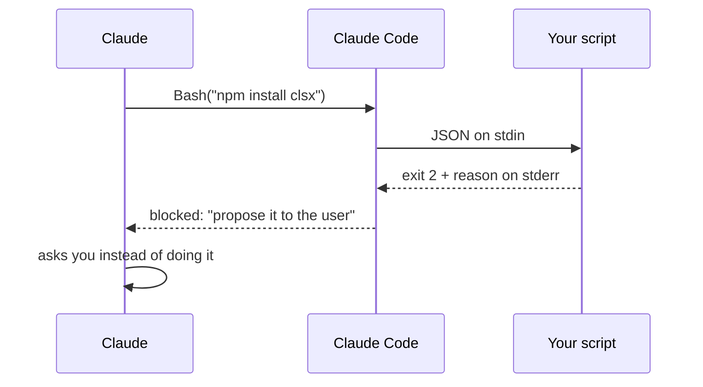
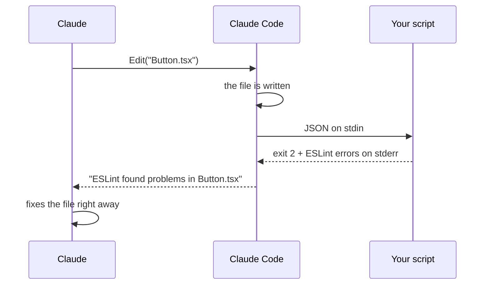

# Hooks

What must never happen

---

## A rule asks, a hook enforces

<div class="cols">
<div class="col">

**Rule**

"Don't add dependencies without asking."

Claude reads it and **decides** to follow it. It almost always does, but it remains **its own decision**.

</div>
<div class="col">

**Hook**

A **command of yours** that Claude Code runs before or after an action, and that can stop it.

**It doesn't go through the model**: it always happens.

</div>
</div>

---

## Before or after: `PreToolUse` and `PostToolUse`

<div class="cols">
<div class="col">

**`PreToolUse`**: before the tool runs

- sees what Claude is **about to do**
- can **block** it: the action never happens
- main goal: **guard**. "This must never happen"

e.g. no `npm install` without asking

</div>
<div class="col">

**`PostToolUse`**: after the tool has run

- sees what Claude **just did**
- can't undo it, but can **react**: check, report, act
- main goal: **feedback**. "Tell Claude right away"

e.g. lint the file just edited

</div>
</div>

<div class="box">

Same mechanism, same script shape: JSON on stdin, exit code out. Only **the moment** changes, and with it what the hook can do.

</div>

Note: there are other events too (Stop, SessionStart, Notification…), but these two cover the two use cases of the section: the no-dependencies guard and the lint after editing.

---

# `PreToolUse`: _blocking_

---

## How it works


```mermaid
sequenceDiagram
  participant C as Claude
  participant CC as Claude Code
  participant H as Your script
  C->>CC: Bash("npm install clsx")
  CC->>H: JSON on stdin
  H-->>CC: exit 2 + reason on stderr
  CC-->>C: blocked: "propose it to the user"
  C->>C: asks you instead of doing it
```

- **exit 0** → let it through
- **exit 2** → block, and whatever you write to **stderr** reaches Claude as the reason

---

## The script

Reads the Bash command Claude wants to run and blocks it if it adds npm packages; everything else passes.

```js [1-5|7-12|14|16-21]
import { readFileSync } from "node:fs";

// Claude Code passes the event data as JSON on stdin.
const { tool_input } = JSON.parse(readFileSync(0, "utf8"));
const command = tool_input?.command ?? "";

// `npm install|i|add` followed by at least one package.
// A bare `npm install`, which reinstalls what's there, passes.
const match = command.match(/\bnpm\s+(?:install|i|add)\b(.*)/);
const packages = match
  ? match[1].trim().split(/\s+/).filter((p) => p && !p.startsWith("-"))
  : [];

if (packages.length === 0) process.exit(0);

console.error(
  `Blocked: \`${command}\` adds ${packages.join(", ")} to the project. ` +
    "Dependencies aren't added here without asking: propose it to the user.",
);
process.exit(2);
```

`.claude/hooks/no-dependencies.mjs`

---

## Test it without Claude

```bash
echo '{"tool_input":{"command":"npm install clsx"}}' \
  | node .claude/hooks/no-dependencies.mjs; echo $?     # message, then 2

echo '{"tool_input":{"command":"npm run check"}}' \
  | node .claude/hooks/no-dependencies.mjs; echo $?     # nothing, then 0
```

<div class="box">

A broken hook **blocks everything or blocks nothing**, and doesn't tell you. Test it by hand first.

</div>

Note: the second case is by far the most frequent. The hook runs on EVERY Bash command and almost always has to let it through silently. On PowerShell the exit code comes from echo $LASTEXITCODE.

---

## Register it in `.claude/settings.json`

```json [2|3|5|6-9]
{
  "hooks": {
    "PreToolUse": [
      {
        "matcher": "Bash",
        "hooks": [
          { "type": "command",
            "command": "node \"$CLAUDE_PROJECT_DIR\"/.claude/hooks/no-dependencies.mjs" }
        ]
      }
    ]
  }
}
```

- **event**: `PreToolUse`, `PostToolUse`, `Stop`, `SessionStart`…
- **`matcher`**: the tool. `Bash`, or `Edit|Write`. Case-sensitive
- **`$CLAUDE_PROJECT_DIR`**: the root, even if Claude is in a subfolder
- `/hooks` in the session to check it was loaded

---

## The result

> install clsx and use it in Button to compose the classes

Claude tries `npm install clsx`, the command **doesn't run**, it gets your message, and asks you whether to add it.

<div class="box">

It didn't obey: **it couldn't**.

</div>

- it holds even with permissions disabled, and for subagents
- `settings.json` gets committed: it applies to the team. For a hook of your own: `settings.local.json`

---

# `PostToolUse`: _reacting_

---

## The other use: acting, silently

Every time Claude edits or creates a file, a hook runs **ESLint on that file only**:

- clean → nothing happens, Claude goes on
- errors → they reach Claude **right away**, and it fixes them on the spot instead of discovering them at the end with `npm run check`

<div class="box">

`PostToolUse` fires after the change is made: it can **report**, not prevent. To prevent you need `PreToolUse`.

</div>

---

## How it works, after


```mermaid
sequenceDiagram
  participant C as Claude
  participant CC as Claude Code
  participant H as Your script
  C->>CC: Edit("Button.tsx")
  CC->>CC: the file is written
  CC->>H: JSON on stdin
  H-->>CC: exit 2 + ESLint errors on stderr
  CC-->>C: "ESLint found problems in Button.tsx"
  C->>C: fixes the file right away
```

- **exit 0** → nothing, Claude goes on
- **exit 2** → the edit **stays**, and whatever you write to **stderr** reaches Claude as feedback

---

## The lint hook

```js [1-6|8-9|11-12|14-18]
import { readFileSync, appendFileSync } from "node:fs";
import { spawnSync } from "node:child_process";

// Claude Code passes the event data as JSON on stdin: here, the file just written.
const { tool_input } = JSON.parse(readFileSync(0, "utf8"));
const file = tool_input?.file_path ?? "";

// Only files the linter understands.
if (!/\.(js|jsx|ts|tsx)$/.test(file)) process.exit(0);

const result = spawnSync("npx", ["eslint", file], { encoding: "utf8" });
appendFileSync(".claude/hooks/hook.log", `${new Date().toISOString()} lint ${file} → ${result.status}\n`);

if (result.status === 0) process.exit(0);

// exit 2 after the edit: the file stays as it is, the errors reach Claude.
console.error(`ESLint found problems in ${file}:\n${result.stdout}`);
process.exit(2);
```

`.claude/hooks/lint-file.mjs`

Note: the log line is the point of the last step. A hook that doesn't block is invisible: without hook.log you never know whether it ran on clean files.

---

## Register both in `.claude/settings.json`

```json [3-10|11-18]
{
  "hooks": {
    "PreToolUse": [
      {
        "matcher": "Bash",
        "hooks": [
          { "type": "command",
            "command": "node \"$CLAUDE_PROJECT_DIR\"/.claude/hooks/no-dependencies.mjs" }
        ]
      }
    ],
    "PostToolUse": [
      {
        "matcher": "Edit|Write",
        "hooks": [
          { "type": "command",
            "command": "node \"$CLAUDE_PROJECT_DIR\"/.claude/hooks/lint-file.mjs" }
        ]
      }
    ]
  }
}
```

- **before** a Bash command → can block it
- **after** an `Edit` or `Write` → can only report, the file is already changed
